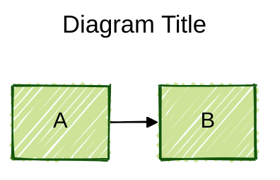
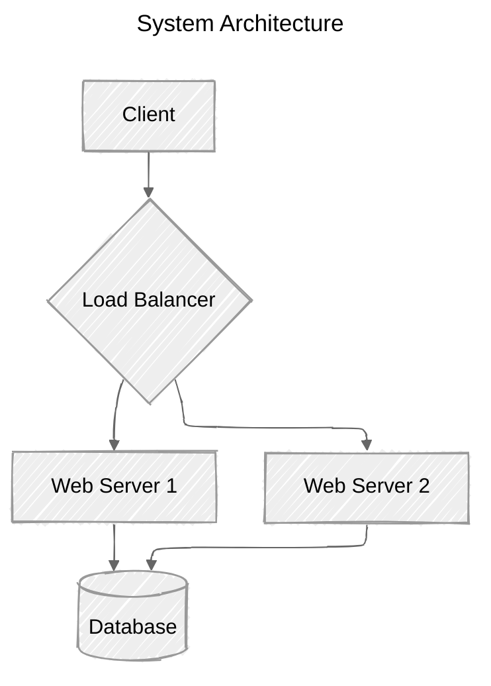

# Mermaid Diagram Creation

Create diagrams using Mermaid's text-based syntax. Mermaid converts text definitions into visual diagrams.

## Quick Start

1. Create a `.mermaid` file in `/mnt/user-data/outputs/`
2. Start with diagram type declaration
3. Add diagram-specific syntax
4. Use `present_files` to share the diagram

## Diagram Types

Mermaid supports these diagram types:

- **flowchart** - Process flows, decision trees, workflows
- **sequenceDiagram** - Message exchanges, API interactions
- **classDiagram** - Object-oriented structures, UML
- **stateDiagram-v2** - State machines, lifecycle diagrams
- **erDiagram** - Database schemas, data models
- **gantt** - Project timelines, schedules
- **pie** - Data distribution, percentages
- **mindmap** - Hierarchical concepts, brainstorming
- **timeline** - Historical events, roadmaps
- **journey** - User experiences, customer journeys
- **gitGraph** - Git branching, version control
- **quadrantChart** - Matrix analysis, prioritization
- **requirementDiagram** - Requirements and relationships

## Syntax Structure

### Basic Pattern

```mermaid
<diagram-type>
    <diagram content>
```

Every diagram begins with its type declaration, followed by content definitions.

### Comments

Use `%%` for line comments:


### Avoiding Syntax Breakers

**Words to wrap in quotes:**
- `end` - Can break flowcharts and sequence diagrams
- Nodes containing special characters or spaces

**Patterns to avoid in comments:**
- `%%{` and `}%%` together - Similar to directives, confuses parser

## Configuration Options

### Frontmatter Configuration

Add YAML frontmatter before diagram definition:



### Available Themes

- `default` - Standard Mermaid theme
- `forest` - Green color scheme
- `dark` - Dark background
- `neutral` - Minimal colors
- `base` - Clean, professional

### Look Options

- `classic` - Traditional Mermaid style
- `handDrawn` - Sketch-like, informal appearance

### Layout Algorithms

**dagre** (default)
- Classic layout
- Good balance of simplicity and clarity
- Ideal for most diagrams

**elk** (advanced)
- Sophisticated layout for complex diagrams
- Reduces overlapping
- Improves readability of large diagrams

Configure ELK with:

```yaml
config:
  layout: elk
  elk:
    mergeEdges: true
    nodePlacementStrategy: LINEAR_SEGMENTS
```

Node placement strategies:
- `SIMPLE`
- `NETWORK_SIMPLEX`
- `LINEAR_SEGMENTS`
- `BRANDES_KOEPF` (default)

## Diagram-Specific Syntax

For detailed syntax of specific diagram types, read the appropriate reference file:

- Flowcharts: `references/flowchart.md`
- Sequence diagrams: `references/sequence-diagram.md`
- Class diagrams: `references/class-diagram.md`
- State diagrams: `references/state-diagram.md`
- ER diagrams: `references/entity-relationship-diagram.md`
- Gantt charts: `references/gantt-diagram.md`
- Pie charts: `references/pie-chart.md`
- Mindmaps: `references/mindmap.md`
- Timelines: `references/timeline.md`
- User journeys: `references/user-journey-diagram.md`
- Git graphs: `references/git-graph.md`
- Quadrant charts: `references/quadrant-chart.md`
- Requirement diagrams: `references/requirement-diagram.md`

## Common Patterns

### Simple Flowchart


### Basic Sequence Diagram


### Entity Relationship Diagram


## Best Practices

1. **Start simple** - Begin with basic structure, add complexity as needed
2. **Use descriptive labels** - Make node/relationship names clear
3. **Wrap special text** - Quote text containing spaces or special characters
4. **Add comments** - Document complex logic or decisions
5. **Configure appearance** - Use themes and layouts for professional output
6. **Test incrementally** - Build diagram step-by-step to catch errors early
7. **Keep it readable** - Avoid overcrowding; split into multiple diagrams if needed

## Workflow

1. Determine appropriate diagram type for user's needs
2. Read relevant reference file if needed for specific syntax
3. Create diagram with appropriate configuration
4. Save to `/mnt/user-data/outputs/diagram.mermaid`
5. Use `present_files` to share with user

## Example with Configuration



This creates a hand-drawn style architecture diagram with ELK layout for optimal node placement.
