# Class Diagram Reference

UML class diagrams show system structure through classes, their attributes, operations, and relationships.

## Basic Structure

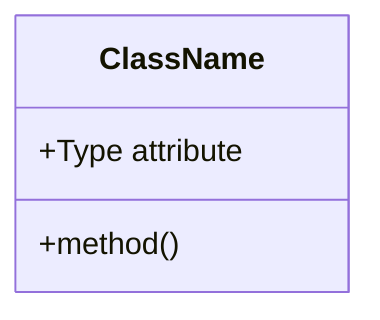

**Three compartments:**
- Top: Class name (bold, centered, capitalized)
- Middle: Attributes (left-aligned, lowercase first letter)
- Bottom: Operations/methods (left-aligned, lowercase first letter)

## Defining Classes

### Two Approaches

**Explicit declaration:**
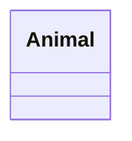

**Via relationship (defines both classes):**
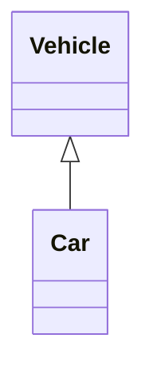

### Class Labels

**Bracket notation for special characters:**
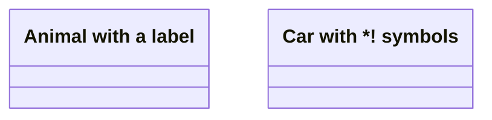

**Backtick notation for escaping:**
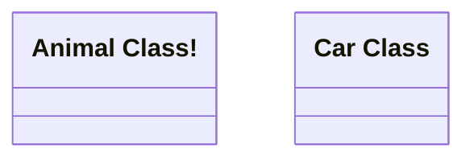

## Members

### Two Definition Styles

**Colon notation (one member per line):**
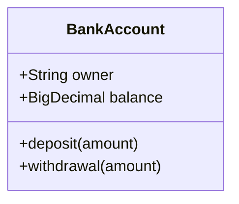

**Bracket notation (grouped members):**


Methods include `()`, attributes do not.

### Return Types

Add return type after method with a space after closing `)`:

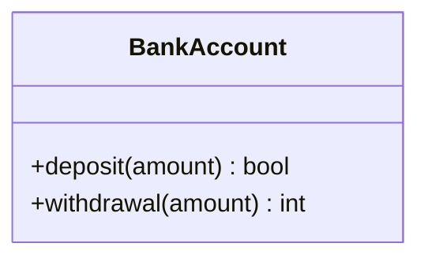

### Generic Types

Use `~` (tilde) to denote generics. Nested types supported (e.g., `List~List~int~~`).

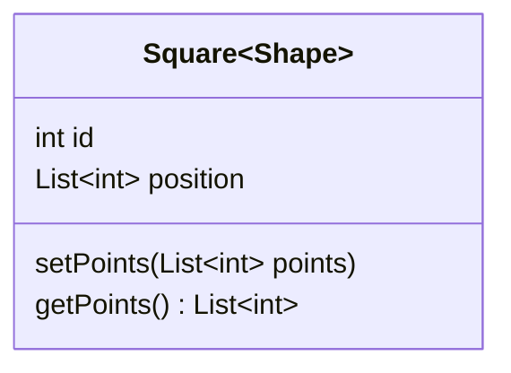

**Note:** Generic type is NOT part of class name for references.

### Visibility

Prefix members with visibility modifiers:

- `+` Public
- `-` Private
- `#` Protected
- `~` Package/Internal

**Method classifiers (suffix after `()` or return type):**
- `*` Abstract: `someMethod()*` or `someMethod() int*`
- `$` Static: `someMethod()$` or `someMethod() String$`

**Field classifiers (suffix):**
- `$` Static: `String field$`

## Relationships

### Syntax: `[classA][Arrow][ClassB]`

**Eight relationship types:**

| Type    | Description   |
|---------|---------------|
| `<\|--` | Inheritance   |
| `*--`   | Composition   |
| `o--`   | Aggregation   |
| `-->`   | Association   |
| `--`    | Link (Solid)  |
| `..>`   | Dependency    |
| `..\|>` | Realization   |
| `..`    | Link (Dashed) |

**Arrows work in both directions:**
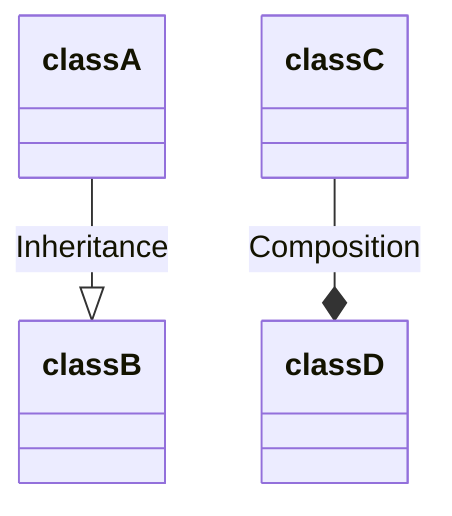

### Labels

Add labels with `:LabelText`:
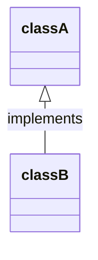

### Two-way Relations

Format: `[Relation Type][Link][Relation Type]`

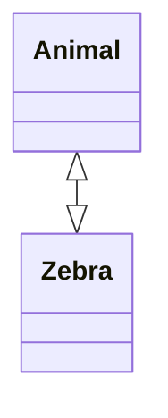

**Relation Types:**
- `<|` Inheritance
- `*` Composition
- `o` Aggregation
- `>` Association
- `<` Association
- `|>` Realization

**Link Types:**
- `--` Solid
- `..` Dashed

### Lollipop Interfaces

Special syntax for interface relationships:

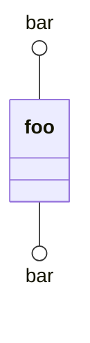

Interface (bar) connects to class (foo). Each interface is unique per connection.

## Cardinality/Multiplicity

Show relationship quantities:

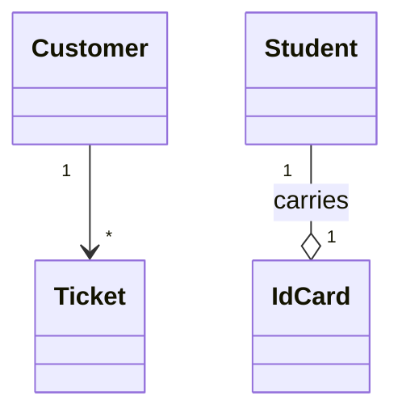

**Common notations:**
- `1` - Exactly one
- `0..1` - Zero or one
- `1..*` - One or more
- `*` - Many
- `n` - n instances
- `0..n` - Zero to n
- `1..n` - One to n

## Annotations

**Supported annotations:**
- `<<Interface>>` - Interface class
- `<<Abstract>>` - Abstract class
- `<<Service>>` - Service class
- `<<Enumeration>>` - Enumeration

Add inside class definition:
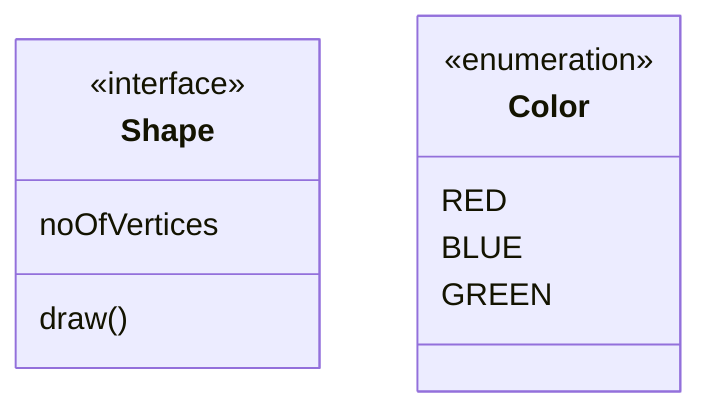

## Comments

Use `%%` at line start (entire line ignored):
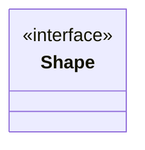

## Direction

Set diagram orientation:
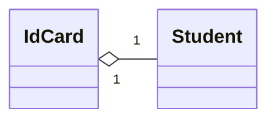

**Options:** `TB` (top-bottom), `BT`, `RL` (right-left), `LR`

## Notes

**General note:**
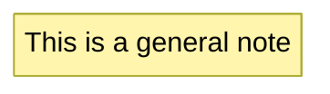

**Class-specific note:**
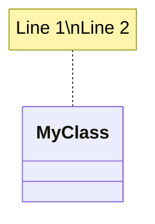

## Interactions

Add after all classes declared (requires `securityLevel='loose'`):

**Link:**
```mermaid
classDiagram
    link ClassName "url" "tooltip"
    click ClassName href "url" "tooltip"
```

**Callback:**
```mermaid
classDiagram
    callback ClassName "callbackFunction" "tooltip"
    click ClassName call callbackFunction() "tooltip"
```

## Styling

### Individual Node Styling

```mermaid
classDiagram
    style Animal fill:#f9f,stroke:#333,stroke-width:4px
    style Mineral fill:#bbf,stroke:#f66,stroke-width:2px,stroke-dasharray: 5 5
```

**Note:** Cannot style notes or namespaces individually.

### Style Classes

**Define class:**
```
classDef className fill:#f9f,stroke:#333,stroke-width:4px;
```

**Apply to node:**
```
cssClass "nodeId" className;
```

**Apply to multiple:**
```
cssClass "nodeId1,nodeId2" className;
```

**Shorthand with `:::`:**
```mermaid
classDiagram
    class Animal:::someclass
    classDef someclass fill:#f96
```

Or with body:
```mermaid
classDiagram
    class Animal:::someclass {
        -int size
    }
    classDef someclass fill:#f96
```

### Default Class

Applied to all nodes (override with specific styles):
```
classDef default fill:#f9f,stroke:#333,stroke-width:4px;
```

### CSS Classes

Predefine in CSS, apply from diagram:

```html
<style>
  .styleClass > * > g {
    fill: #ff0000;
    stroke: #ffff00;
    stroke-width: 4px;
  }
</style>
```

```mermaid
classDiagram
    class Animal:::styleClass
```

**Note:** Cannot combine cssClasses shorthand with relation statements.

## Configuration

### Hide Empty Members Box

Set `hideEmptyMembersBox: true` in config:

```mermaid
---
config:
  class:
    hideEmptyMembersBox: true
---
classDiagram
    class Duck
```

## Naming Conventions

- Class names: alphanumeric (including unicode), underscores, dashes only
- Member distinction: Methods have `()`, attributes do not
