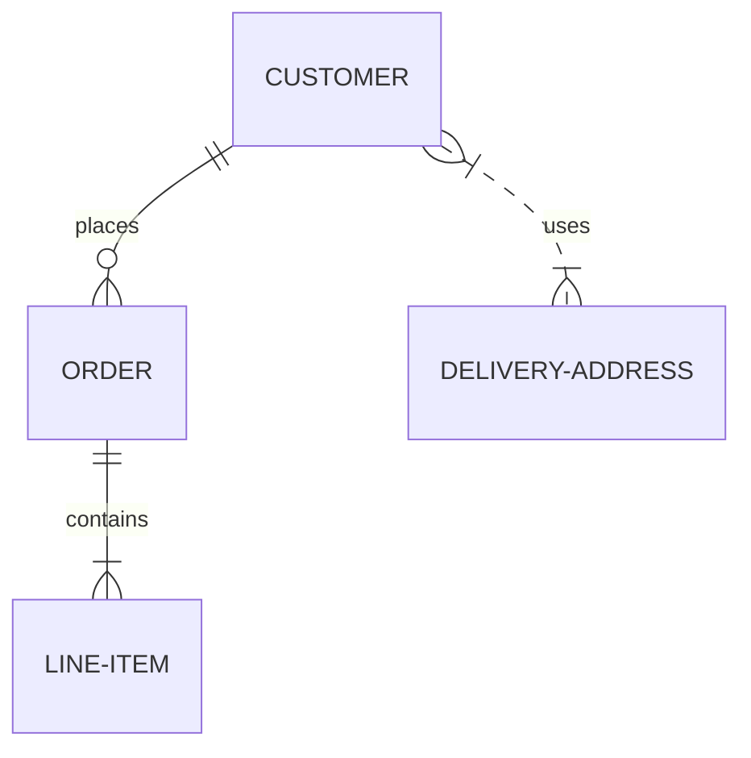
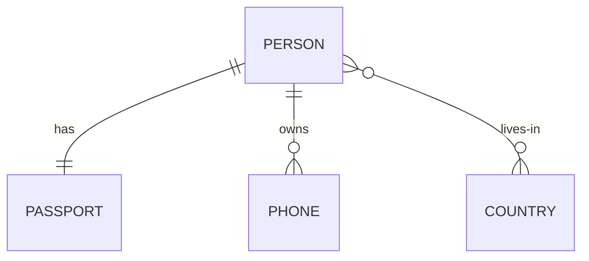
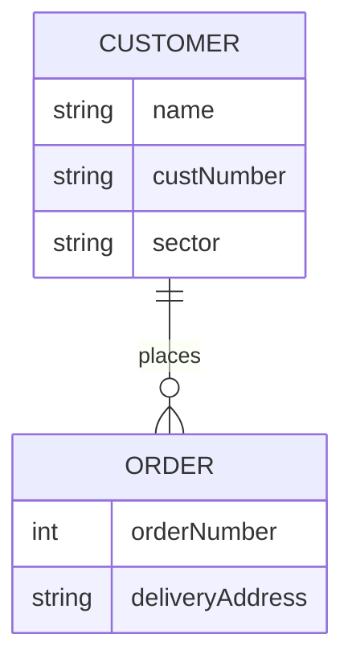
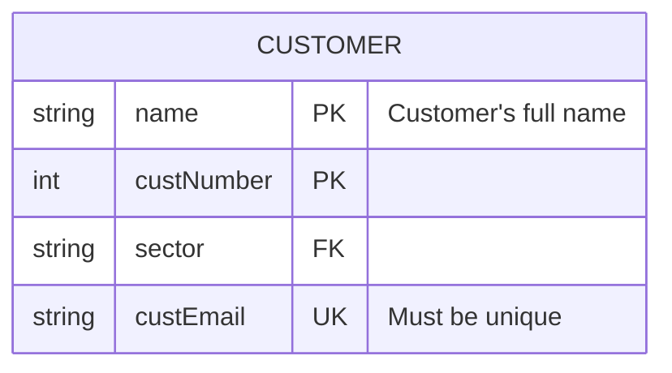
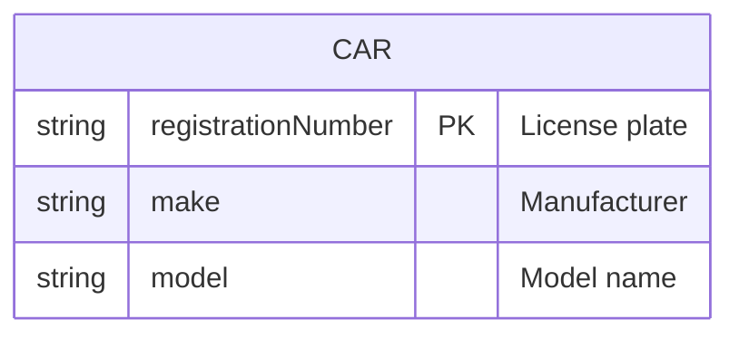
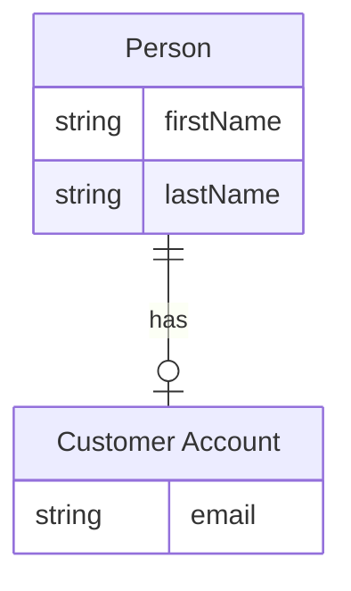
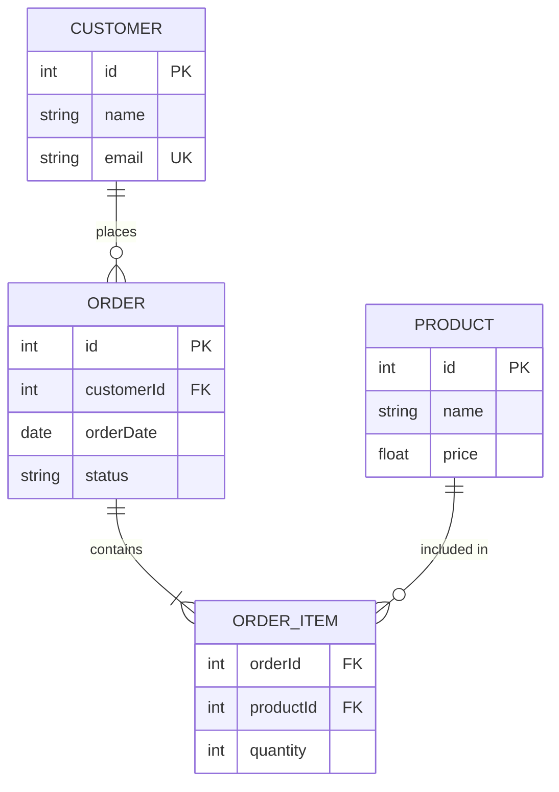
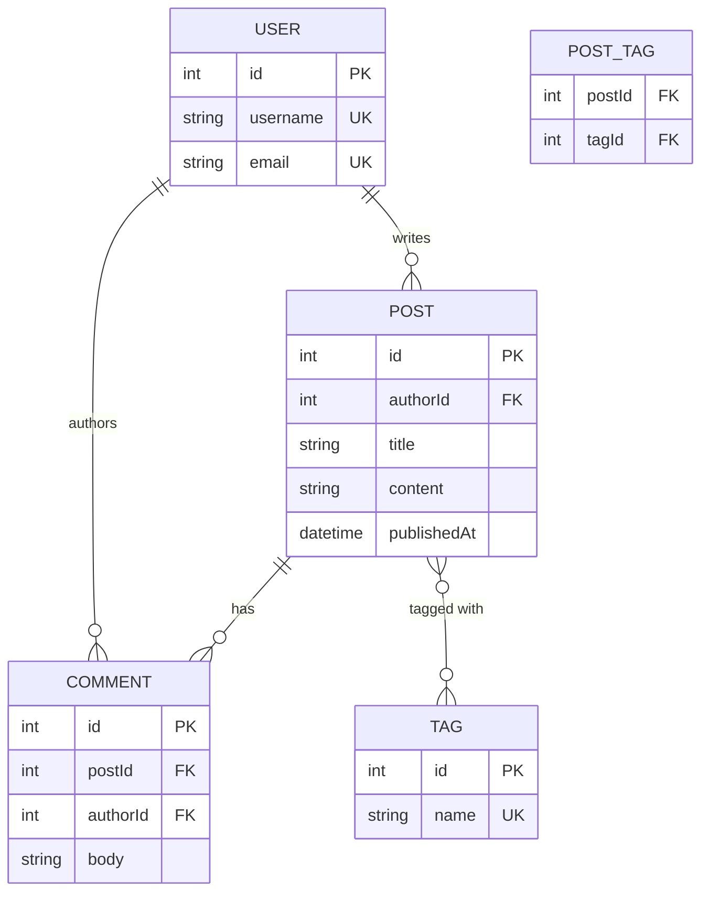
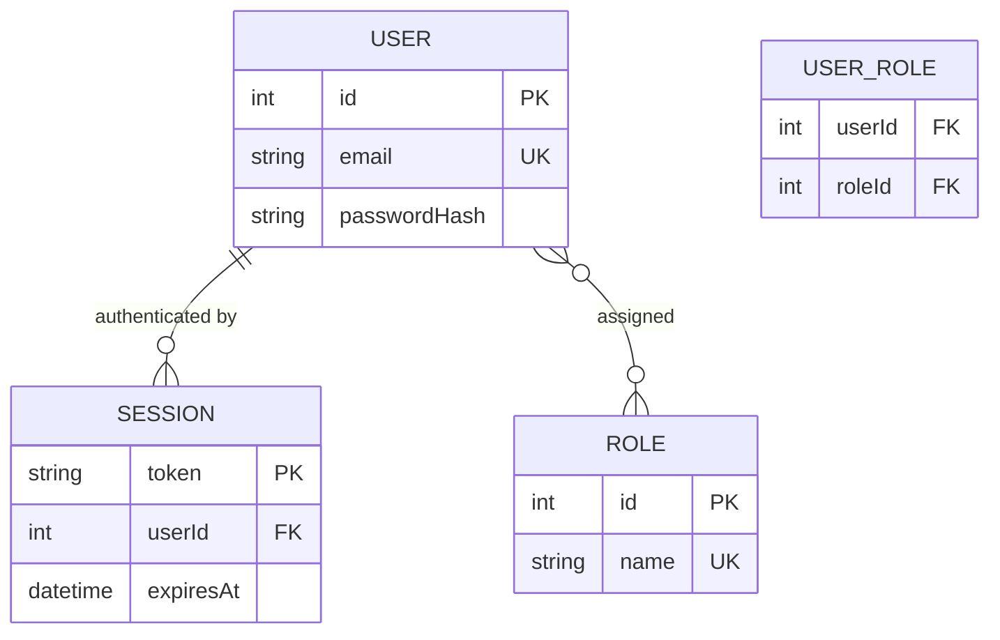

# Entity Relationship Diagram Reference

ER diagrams model entities, their attributes, and the relationships between them — ideal for database schema design and data modeling.

## Basic Syntax



## Entities and Relationships

### Relationship Syntax

Format: `ENTITY-A [relationship] ENTITY-B : label`

### Cardinality Symbols

| Value (left) | Value (right) | Meaning |
| --- | --- | --- |
| `\|o` | `o\|` | Zero or one |
| `\|\|` | `\|\|` | Exactly one |
| `}o` | `o{` | Zero or more |
| `}\|` | `\|{` | One or more |

**Combined in a relationship:**

```text
ENTITY-A ||--o{ ENTITY-B : label
```

- Left side uses the left-value symbol
- Right side uses the right-value symbol
- `--` solid line (identifying) or `..` dashed line (non-identifying)

**Examples:**



### Identification

- `--` (two dashes) - Identifying relationship: child cannot exist without parent
- `..` (two dots) - Non-identifying relationship: child can exist independently

## Attributes

### Attribute Syntax



### Attribute Types

Common types (not enforced by Mermaid, for documentation only):

- `string`
- `int`
- `float`
- `boolean`
- `date`
- `datetime`
- `enum`

### Keys

Mark attributes as keys with a suffix keyword:



**Key types:**

- `PK` - Primary key
- `FK` - Foreign key
- `UK` - Unique key

### Comments on Attributes

Add a quoted string after the type and optional key:



## Entity Names with Aliases

Use an alias to provide a human-readable label while keeping the internal ID short:



## Common Patterns

### E-commerce Schema



### Blog Schema



### Authentication Schema


