# Flowchart Reference

Comprehensive guide for creating flowcharts with Mermaid syntax.

## Quick Start


**Direction options**: `LR` (left-right), `RL` (right-left), `TD`/`TB` (top-down), `BT` (bottom-top)

## Node Shapes

### Basic Shapes


**Syntax patterns**:
- `id[Text]` - Rectangle
- `id(Text)` - Rounded edges
- `id([Text])` - Stadium
- `id[[Text]]` - Subroutine
- `id[(Text)]` - Cylinder/Database
- `id((Text))` - Circle
- `id>Text]` - Asymmetric (flag)
- `id{Text}` - Diamond/Rhombus
- `id{{Text}}` - Hexagon
- `id(((Text)))` - Double circle

### Parallelograms and Trapezoids


**Syntax patterns**:
- `id[/Text/]` - Parallelogram (lean right)
- `id[\Text\]` - Parallelogram alt (lean left)
- `id[/Text\]` - Trapezoid (base bottom)
- `id[\Text/]` - Trapezoid alt (base top)

### Extended Shapes (v11.3.0+)

Use `@{ shape: type, label: "text" }` syntax for 30+ additional shapes:


**Common extended shapes**:
- `rect` - Rectangle/Process
- `rounded` - Rounded rectangle/Event
- `stadium` - Stadium/Terminal point
- `subproc` - Subprocess (double border)
- `cyl` - Cylinder/Database
- `circle` - Circle/Start
- `diamond` - Diamond/Decision
- `hex` - Hexagon/Prepare conditional
- `lean-r` - Lean right/Input-Output
- `lean-l` - Lean left/Output-Input
- `trap-b` - Trapezoid base bottom/Priority action
- `trap-t` - Trapezoid base top/Manual operation
- `dbl-circ` - Double circle/Stop
- `odd` - Odd shape
- `docs` - Multiple documents
- `doc` - Document
- `procs` - Multiple processes
- `stored-data` - Stored data
- `lin-cyl` - Lined cylinder
- `lin-doc` - Lined document
- `notch-rect` - Notched rectangle
- `fork` - Fork/Join
- `curv-trap` - Curved trapezoid
- `div-rect` - Divided rectangle
- `div-proc` - Divided process
- `tag-doc` - Tagged document
- `tag-rect` - Tagged rectangle
- `hourglass` - Hourglass
- `comment` - Comment
- `brace-l` - Left brace
- `brace-r` - Right brace
- `braces` - Braces
- `bracks` - Brackets
- `crossroad` - Crossroad
- `win-pane` - Window pane
- `f-circ` - Filled circle
- `delay` - Delay
- `das` - Direct access storage
- `disk` - Disk storage
- `display` - Display
- `junction` - Junction
- `collate` - Collate
- `extract` - Extract
- `internal-storage` - Internal storage
- `lin-pred` - Lined predefined process
- `summary` - Summary
- `manual-file` - Manual file
- `manual-input` - Manual input
- `paper-tape` - Paper tape
- `sm-circ` - Small circle
- `start` - Start
- `stop` - Stop
- `processes` - Processes

## Links and Arrows

### Basic Links


**Link types**:
- `-->` - Arrow
- `---` - Line (no arrow)
- `-.->` - Dotted arrow
- `==>` - Thick arrow

### Link Text


**Alternative syntax**:
- `A -- text --> B`
- `A -. text .-> B`
- `A == text ==> B`

### Multi-directional Arrows


**Bidirectional types**:
- `<-->` - Bidirectional arrow
- `o--o` - Circle edges
- `x--x` - Cross edges
- `<-.->` - Dotted bidirectional
- `<==>` - Thick bidirectional

### Multi-node Links


**Syntax**: `A --> B & C` connects A to both B and C

### Chaining Links


### Edge IDs and Styling (v11.10.0+)


**Curve styles**: `basis`, `bumpX`, `bumpY`, `cardinal`, `catmullRom`, `linear`, `monotoneX`, `monotoneY`, `natural`, `step`, `stepAfter`, `stepBefore`

## Text Formatting

### Unicode Text

```mermaid
flowchart LR
    id["Unicode ❤ supported"]
```



Use `"` to enclose unicode text.

### Markdown Formatting


Use double quotes and backticks `"` text `"` for markdown. Requires `htmlLabels: false` in config.

### Line Breaks

Use `<br>` or `<br/>` for line breaks in text:


## Subgraphs


**Syntax**:
```
subgraph title
  graph definition
end
```

**Subgraph direction** (v10.7.0+):
```
subgraph id [title]
  direction TB
  nodes...
end
```

## Styling

### Node Styling


**Style properties**: `fill`, `stroke`, `stroke-width`, `color`, `stroke-dasharray`

### Classes

Define and apply style classes:


**Syntax**:
- Define: `classDef className fill:#f9f,stroke:#333,stroke-width:4px;`
- Apply inline: `id:::className`
- Apply separately: `class id1,id2 className;`
- Multiple classes: `classDef class1,class2 font-size:12pt;`

**Default class**: Class named `default` applies to all nodes without specific classes.

### Link Styling


**Syntax**: `linkStyle <index> stroke:#ff3,stroke-width:4px,color:red;`

Links are indexed from 0 in order of definition. Can style multiple: `linkStyle 1,2,7 color:blue;`

## FontAwesome Icons


**Syntax**: `fa:icon-name` or `fab:icon-name`, `fas:icon-name`, `far:icon-name`, `fal:icon-name`, `fad:icon-name`, `fak:icon-name` (custom)

Requires FontAwesome CSS or registered icon packs (v11.7.0+).

## Interactivity

### Click Events


**Syntax**:
- Callback: `click nodeId callback "tooltip"`
- Link: `click nodeId "url" "tooltip" _blank`
- Href: `click nodeId href "url" "tooltip" _blank`

## Comments


Comments start with `%%` and continue to end of line.

## Configuration

### Renderer Selection

```
---
config:
  flowchart:
    defaultRenderer: "elk"
---
```

**Renderers**: `dagre` (default), `elk` (better for complex diagrams, v9.4+)

### Curve Style

```
---
config:
  flowchart:
    curve: stepBefore
---
```

### Width

```javascript
mermaid.flowchartConfig = {
  width: "100%"
}
```

## Critical Warnings

**Reserved word "end"**: Capitalize any letter in "end" or use workaround. `end` in lowercase breaks flowcharts.

**Circle/cross edges**: Starting a node ID with `o` or `x` after `---` creates special edges:
- `A---oB` creates circle edge
- `A---xB` creates cross edge

To avoid, add space (`A--- oB`) or capitalize (`A---OB`).

## Common Patterns

### Decision Tree

```mermaid
flowchart TD
    A{Decision} -->|Yes| B[Action 1]
    A -->|No| C[Action 2]
    B --> D[Result]
    C --> D
```

### Process Flow

```mermaid
flowchart LR
    Start([Start]) --> Process[Process]
    Process --> Decision{Check}
    Decision -->|Pass| End([End])
    Decision -->|Fail| Process
```

### System Architecture

```mermaid
flowchart TB
    User((User))
    subgraph Frontend
      A[Web App]
      B[Mobile App]
    end
    subgraph Backend
      C[API Gateway]
      D[Service Layer]
      E[(Database)]
    end
    User --> A & B
    A & B --> C
    C --> D
    D --> E
```
