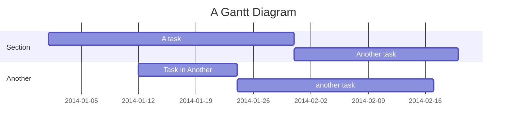
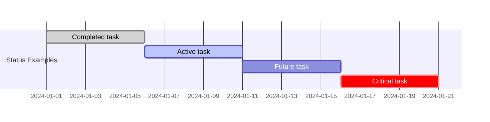
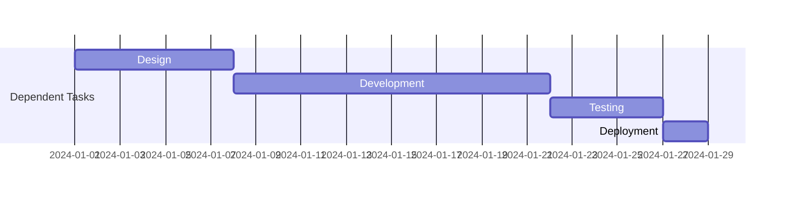
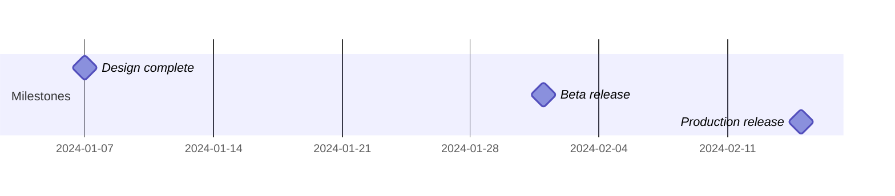
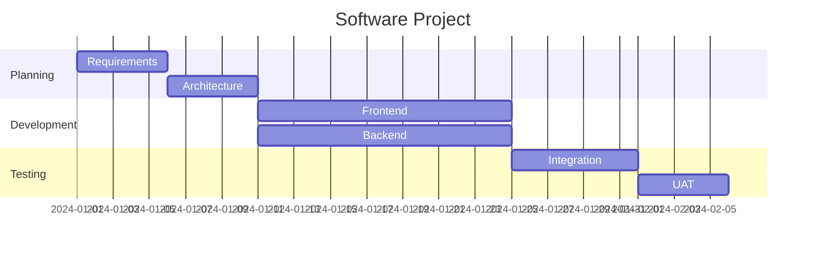
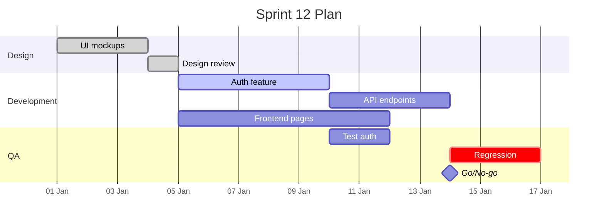
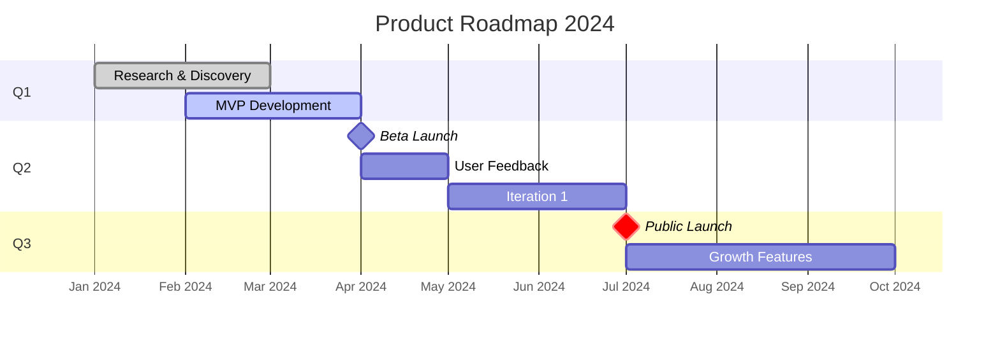

# Gantt Chart Reference

Gantt charts illustrate project schedules showing tasks, durations, and dependencies — great for project planning and roadmaps.

## Basic Syntax



## Required Declarations

### dateFormat

Defines the input date format for task start dates:

```text
dateFormat YYYY-MM-DD
```

**Common tokens:**

| Token | Example | Description |
| --- | --- | --- |
| `YYYY` | `2024` | 4-digit year |
| `YY` | `24` | 2-digit year |
| `MM` | `01`–`12` | Month number |
| `DD` | `01`–`31` | Day of month |
| `HH` | `00`–`23` | Hour (24h) |
| `mm` | `00`–`59` | Minute |
| `ss` | `00`–`59` | Second |

### title

Optional chart title:

```text
title Project Timeline
```

## Tasks

### Task Syntax

```text
taskName : [crit,] [done|active|milestone,] [id,] [startDate,] endDateOrDuration
```

**Components:**

- `taskName` — Display label (required)
- `crit` — Mark as critical path (red highlight)
- `done` — Mark as completed (grayed out)
- `active` — Mark as in-progress (blue highlight)
- `milestone` — Render as a milestone diamond
- `id` — Reference ID for dependencies
- `startDate` — Explicit start date or `after <id>`
- `endDateOrDuration` — End date or duration like `5d`, `2w`, `1h`

### Duration Units

- `d` - days
- `h` - hours
- `m` - minutes (not months)
- `s` - seconds
- `w` - weeks

### Task Status



### Dependencies

Use task IDs in `after` clauses:



Multiple dependencies: `after task1 task2`

### Milestones



Milestones use `0d` duration and render as diamonds.

## Sections

Group related tasks under section headings:



## Display Configuration

### axisFormat

Control the date display on the time axis:

```text
axisFormat %Y-%m-%d
```

**Common format strings:**

- `%Y` - 4-digit year
- `%y` - 2-digit year
- `%m` - Month number
- `%d` - Day
- `%H` - Hour
- `%M` - Minute
- `%b` - Month abbreviation (Jan, Feb…)
- `%B` - Full month name

### tickInterval

Set the interval between axis ticks:

```text
tickInterval 1week
tickInterval 1day
tickInterval 1month
```

### weekday

Set which day starts the week:

```text
weekday monday
```

### todayMarker

Show a vertical line at today's date:

```text
todayMarker on
todayMarker off
todayMarker stroke-width:5px,stroke:#0f0,opacity:0.5
```

### excludes

Exclude weekends or specific dates from scheduling:

```text
excludes weekends
excludes 2024-12-25, 2025-01-01
```

When a task would land on an excluded date, it shifts forward.

## Comments

```mermaid
gantt
    %% This is a comment
    dateFormat YYYY-MM-DD
```

## Common Patterns

### Sprint Planning



### Product Roadmap


