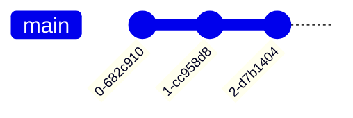
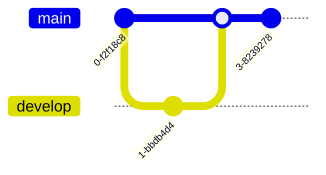
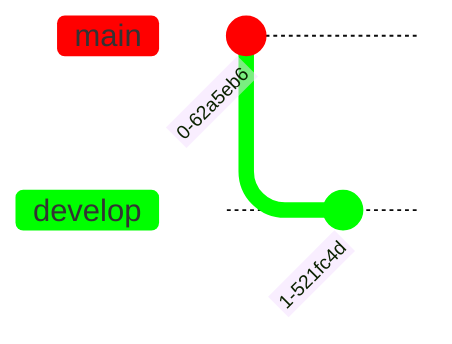
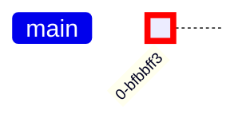

# Git Graph Diagrams

Git Graphs are pictorial representations of git commits and actions on various branches, particularly helpful for visualizing branching strategies and git flow.

## Basic Structure

Always start with the `gitGraph` keyword. The diagram initializes with a `main` branch by default.

## Core Commands

### commit
Register a commit on the current branch.

**Attributes:**
- `id: "custom_id"` - Custom commit identifier
- `type: NORMAL|REVERSE|HIGHLIGHT` - Visual representation
  - `NORMAL`: Solid circle (default)
  - `REVERSE`: Crossed solid circle
  - `HIGHLIGHT`: Filled rectangle
- `tag: "tag_name"` - Add release/version tag

**Examples:**

### branch
Create and switch to a new branch (sets it as current).

**Usage:**
- `branch develop`
- `branch "cherry-pick"` (use quotes for names that could be keywords)
- Branch name must be unique

**Order control:**
- `branch develop order: 2` - Control visual branch ordering (lower = left, higher = right)

### checkout / switch
Switch to an existing branch (sets it as current). Both keywords are interchangeable.

### merge
Merge a branch into the current branch. Creates a merge commit (filled double circle).

**Attributes:**
- `id: "merge_id"` - Custom merge commit ID
- `tag: "tag_name"` - Tag for merge commit
- `type: NORMAL|REVERSE|HIGHLIGHT` - Override merge commit shape

**Example:**

### cherry-pick
Apply a commit from another branch to the current branch.

**Syntax:**
- `cherry-pick id:"commit_id"` - Cherry-pick specific commit
- `cherry-pick tag:"tag_name"` - Cherry-pick tagged commit
- Supports same attributes as commit: `id`, `type`, `tag`, `parent`

**Parent specification:**

## Advanced Features

### Commit Ordering and Parents
Control commit positioning using `parent` attribute:

### Branch Ordering
Control visual branch layout:

### Multiple Parents (Merge Commits)
Specify multiple parents for complex merges:

## Theming and Customization

### Branch Colors
Customize using `git0` through `git7` theme variables (supports up to 8 branches, then cycles):

### Branch Label Colors
Use `gitBranchLabel0` through `gitBranchLabel7`:

### Commit Styling
- `commitLabelColor` - Commit label text color
- `commitLabelBackground` - Commit label background
- `commitLabelFontSize` - Font size (e.g., `'16px'`)

### Tag Styling
- `tagLabelColor` - Tag text color
- `tagLabelBackground` - Tag background color
- `tagLabelBorder` - Tag border color
- `tagLabelFontSize` - Font size (e.g., `'16px'`)

### Highlight Commit Colors
Use `gitInv0` through `gitInv7` for branch-specific highlight commits:

## Common Patterns

### Git Flow

### Hotfix Workflow

### Feature Branches

## Best Practices

1. **Branch naming**: Use descriptive names; quote names that could be keywords
2. **Commit IDs**: Use consistent ID patterns (e.g., semantic versions, short hashes)
3. **Visual clarity**: Use `HIGHLIGHT` type sparingly for important commits
4. **Tags**: Apply to release commits and major milestones
5. **Branch ordering**: Use `order` attribute for complex diagrams with many branches
6. **Theming**: Apply consistent color schemes for branch types (e.g., main, develop, feature)