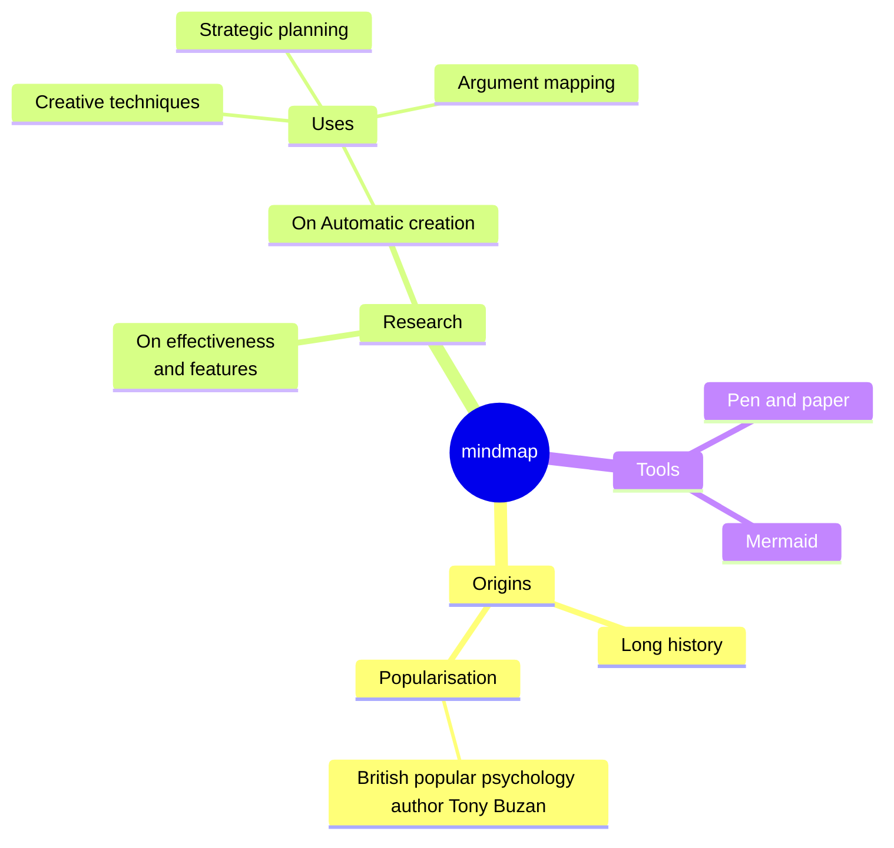
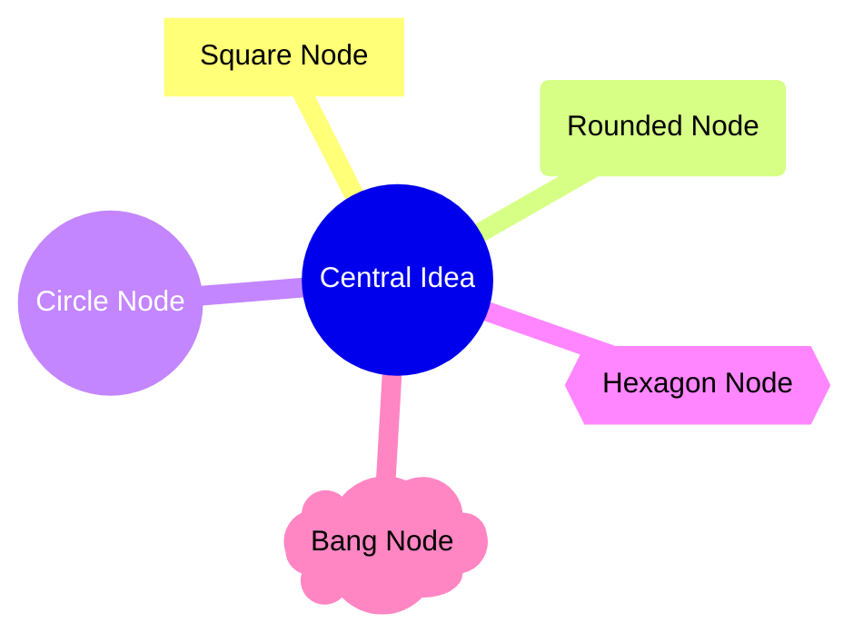
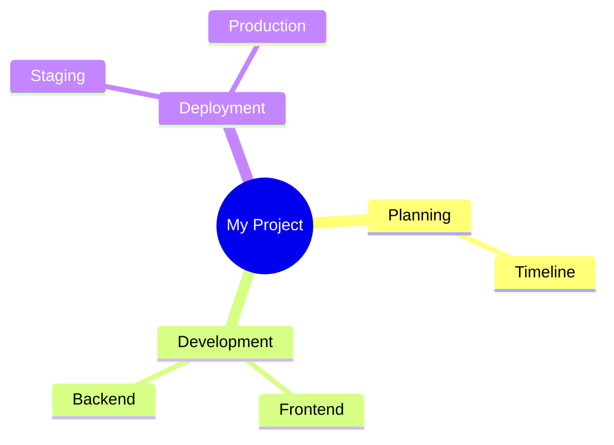
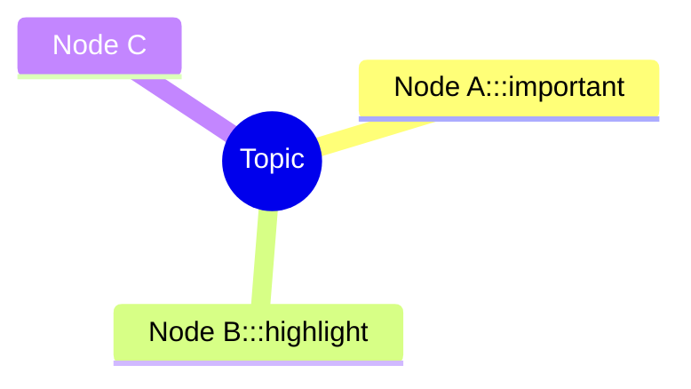
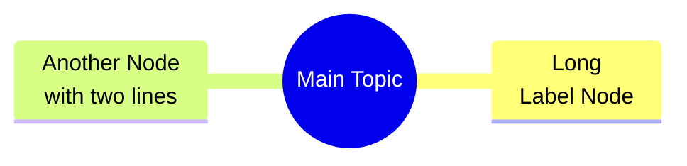
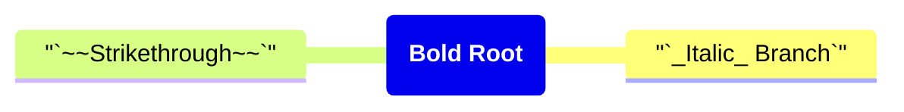
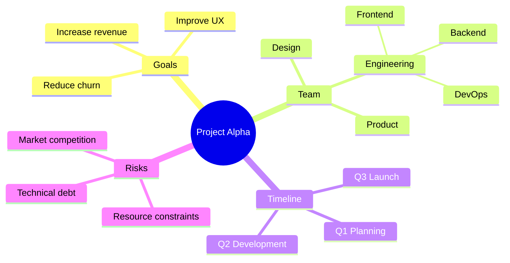
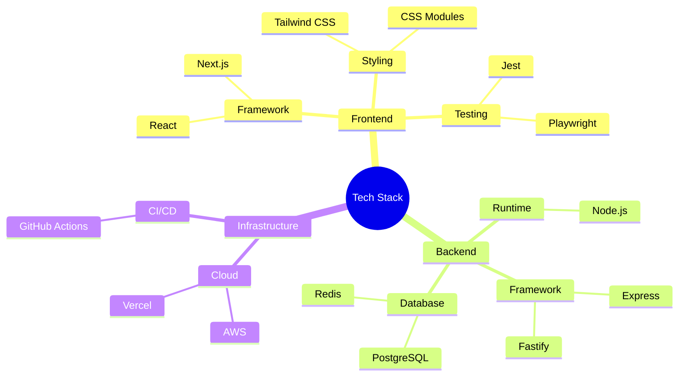
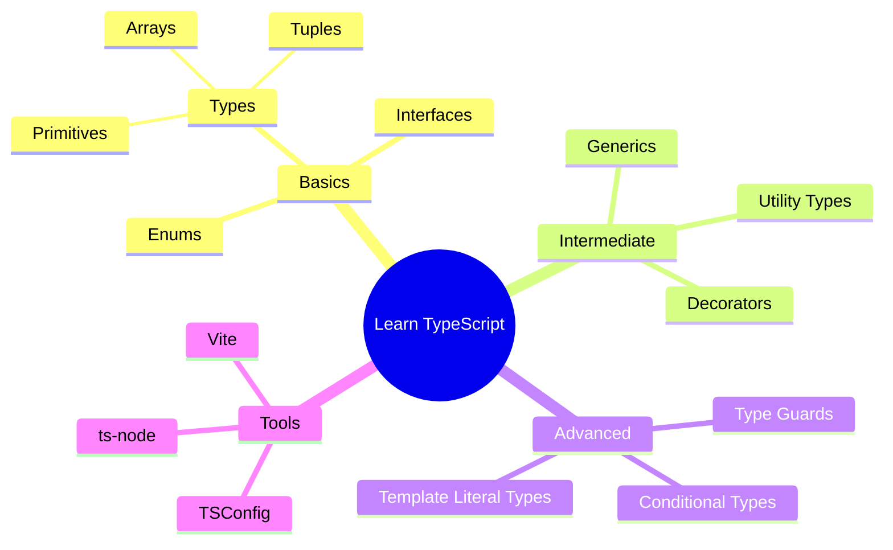

# Mindmap Reference

Mindmaps visualize hierarchical information radiating from a central concept — ideal for brainstorming, knowledge mapping, and concept exploration.

## Basic Syntax



The first non-whitespace line after `mindmap` is the root node. Indentation defines the hierarchy.

## Node Shapes

Control node appearance using delimiters:

| Shape | Syntax | Description |
| --- | --- | --- |
| Default | `text` | Rounded rectangle |
| Square | `[text]` | Rectangle |
| Rounded | `(text)` | Rounded edges |
| Circle | `((text))` | Circle |
| Bang | `)text(` | Explode/cloud shape |
| Cloud | `)text(` | Cloud |
| Hexagon | `{{text}}` | Hexagon |



## Icons

Add icons to nodes using `::icon()` syntax:



Requires FontAwesome to be loaded in the environment.

## Classes

Apply CSS classes to nodes for custom styling:



Define styles in your CSS:

```css
.important { fill: #f96; }
.highlight { stroke: #f00; }
```

## Line Breaks in Nodes

Use `<br>` or `<br/>` to create multiline labels:



## Markdown Formatting

Use backtick-wrapped strings for Markdown inside nodes:



## Common Patterns

### Project Breakdown



### Technology Stack



### Learning Map


