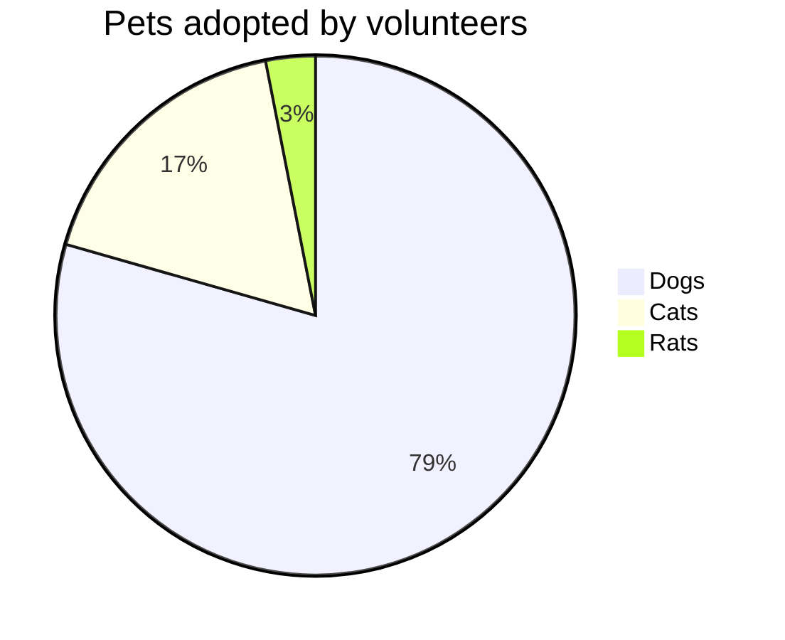
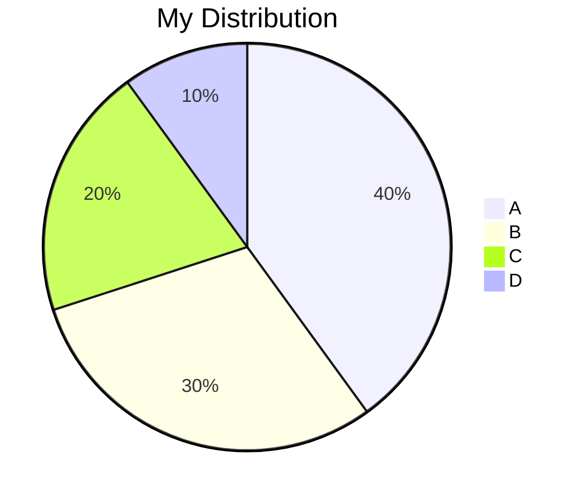
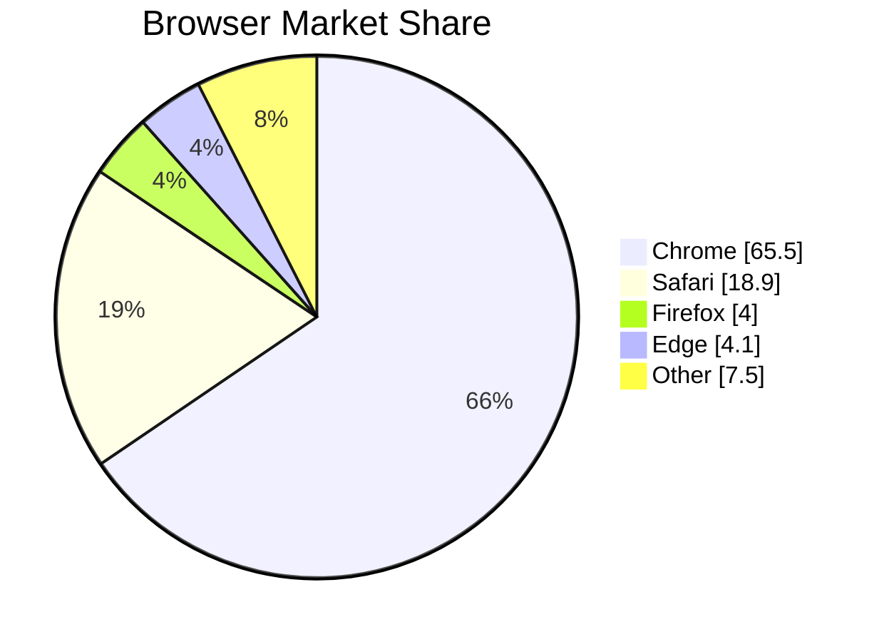
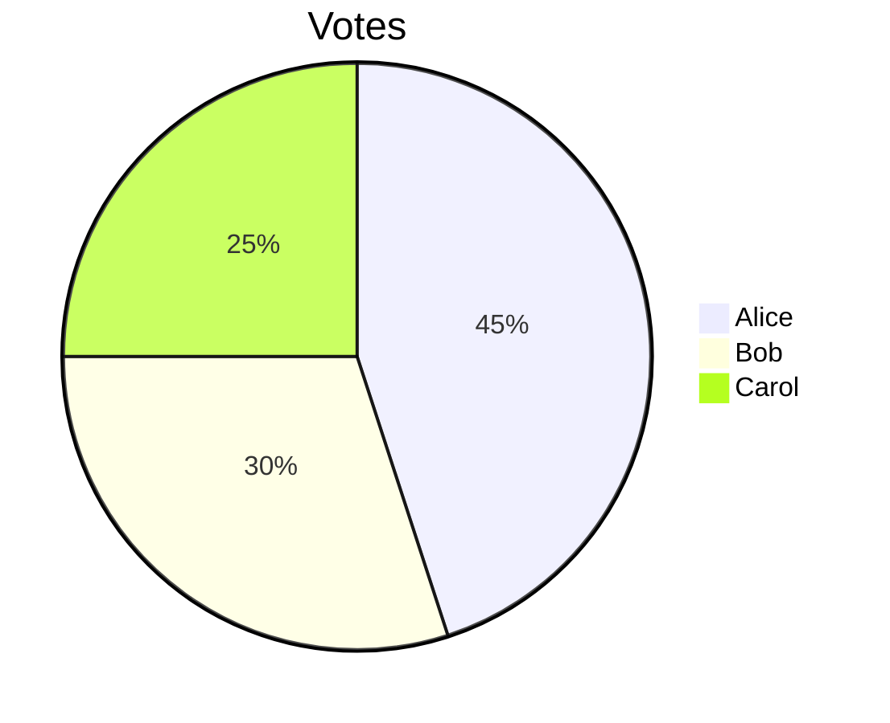
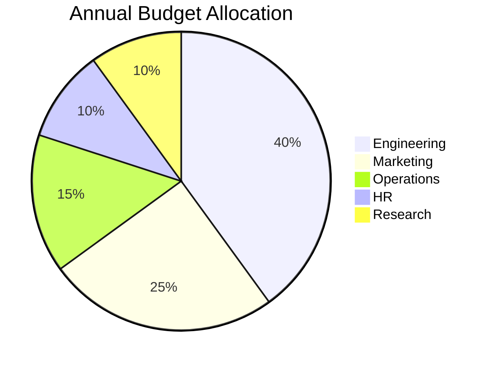
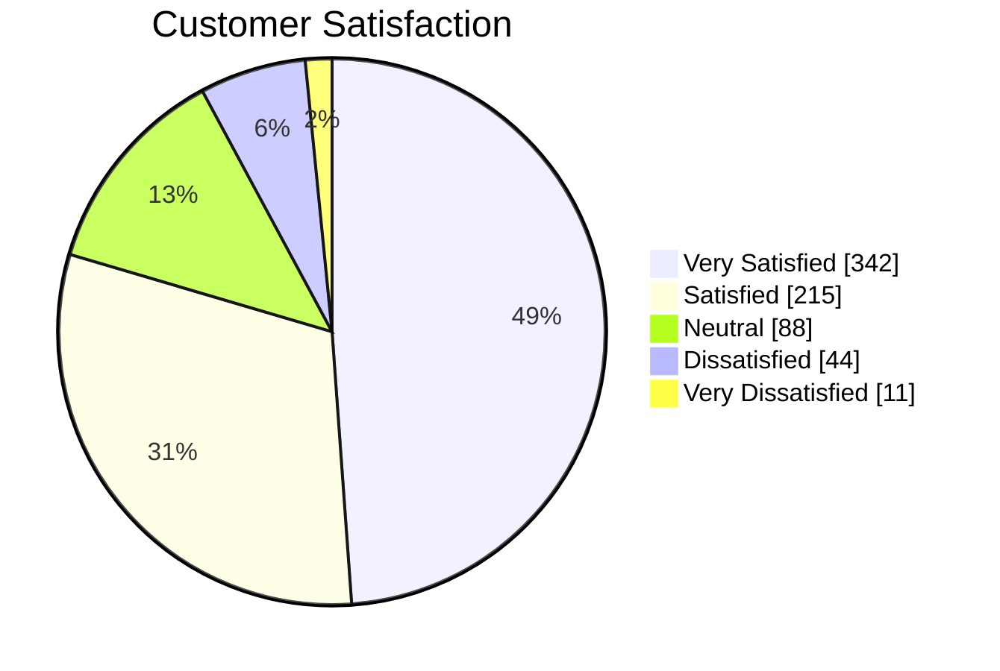
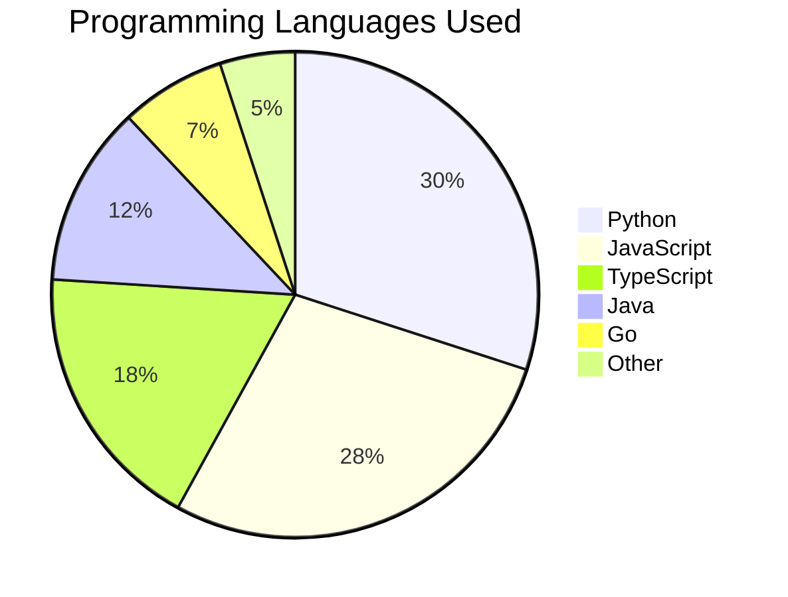

# Pie Chart Reference

Pie charts display proportional data as slices of a circle — ideal for showing percentages, distributions, and part-to-whole relationships.

## Basic Syntax

Each slice is defined as `"Label" : value`. Labels must be quoted. Values are relative weights (not required to sum to 100).

## Title

Add an optional title inline or via frontmatter:

## Show Data (percentages on slices)

Use `showData` to display raw values on the slices instead of percentages:

## Configuration

### textPosition

Control where label text appears — `0` is center, `1` is outer edge (default `0.75`):

## Common Patterns

### Budget Allocation

### Survey Results

### Technology Usage

## Tips

- Slices render in the order they are declared
- Values are automatically normalized to percentages
- Use `showData` when exact counts matter more than proportions
- Keep slices to 5–7 for readability; combine small values into "Other"
