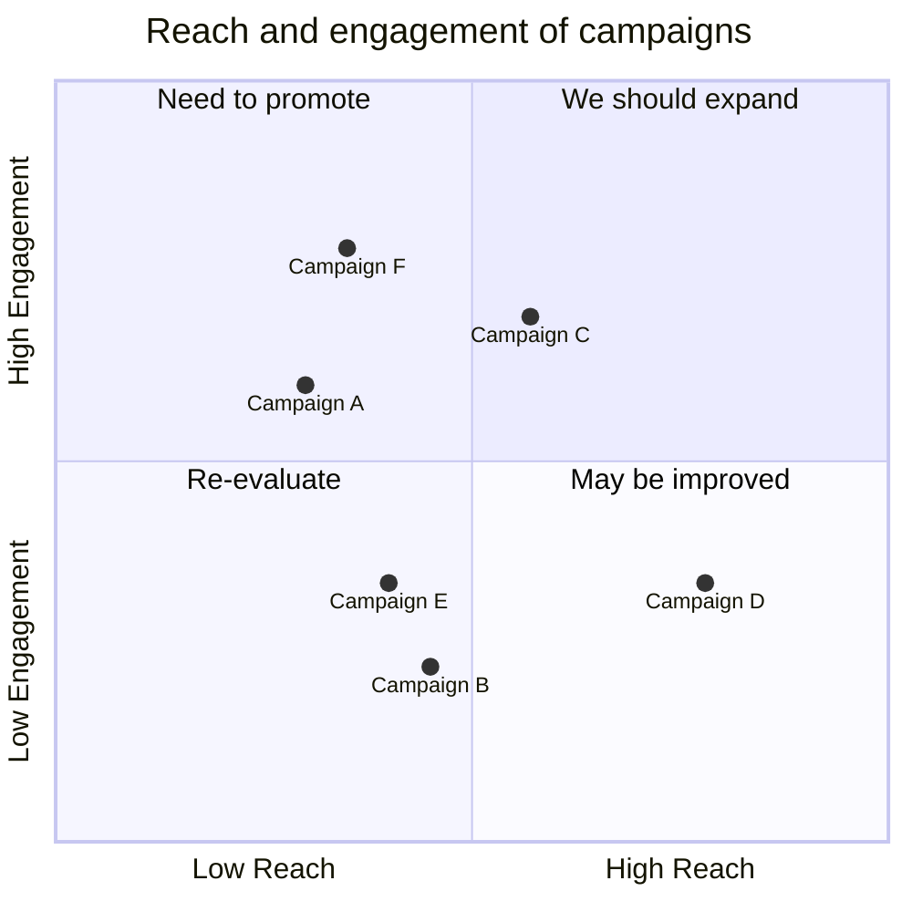
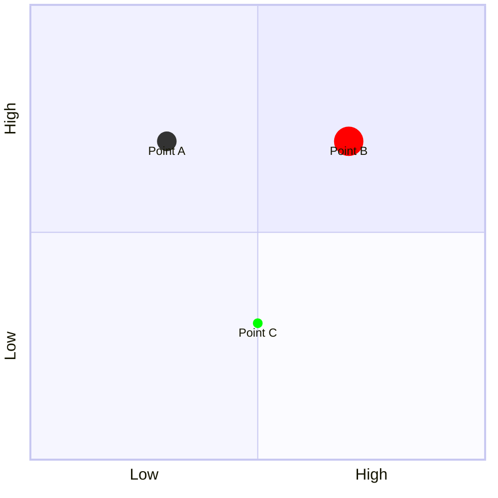
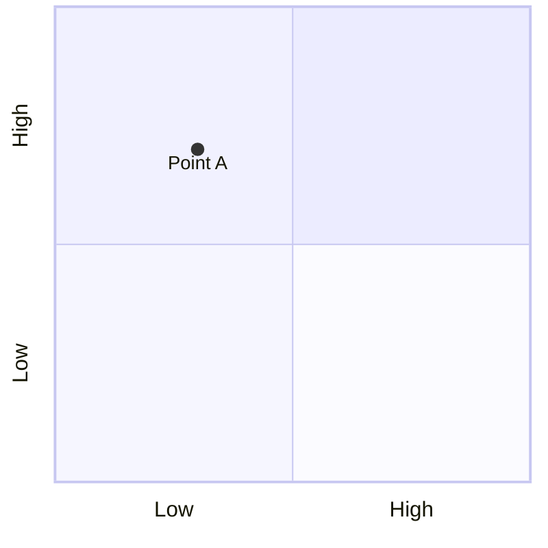
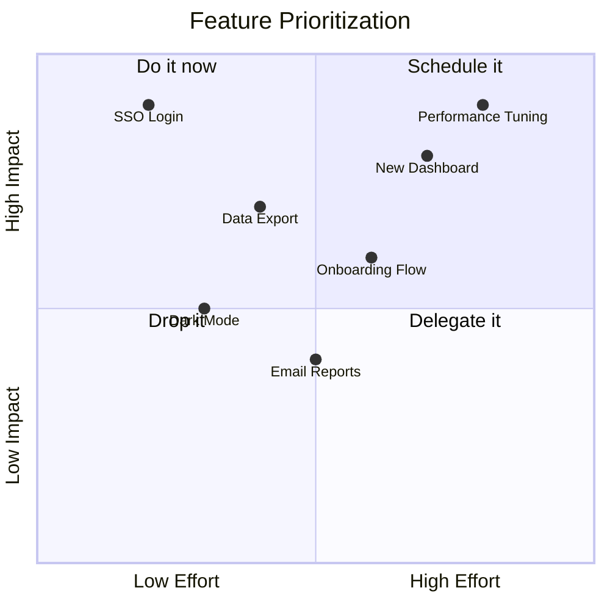
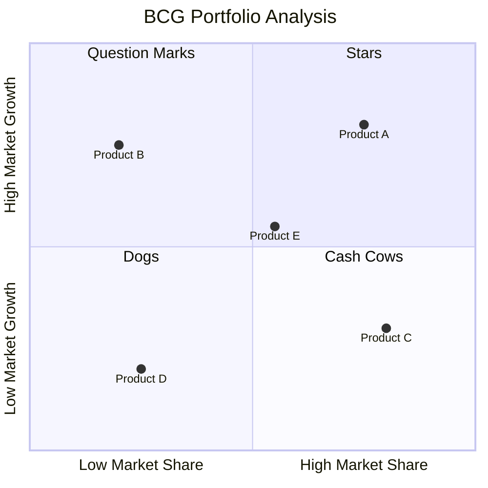

# Quadrant Chart Reference

Quadrant charts plot items on an X-Y grid divided into four quadrants — ideal for priority matrices, risk assessments, and strategic analysis (e.g., BCG matrix, effort/impact grids).

## Basic Syntax



## Axes

### Axis Labels

Define axis labels with optional directional arrows:

```text
x-axis <left label> --> <right label>
y-axis <bottom label> --> <top label>
```

Or omit arrows for simple labels:

```text
x-axis "Label"
y-axis "Label"
```

## Quadrant Labels

Label each quadrant (optional):

```text
quadrant-1 <top-right label>
quadrant-2 <top-left label>
quadrant-3 <bottom-left label>
quadrant-4 <bottom-right label>
```

## Points

Plot points with coordinates in the range `[0, 1]`:

```text
Point Name: [x, y]
```

- `x = 0` is the left edge; `x = 1` is the right edge
- `y = 0` is the bottom edge; `y = 1` is the top edge
- The quadrant midpoint is `[0.5, 0.5]`

### Point Styling (v11.x+)

Customize individual point appearance:



**Style attributes:**

- `radius` - Circle size in pixels
- `color` - Fill color (hex or name)
- `stroke-color` - Border color
- `stroke-width` - Border width (e.g., `2px`)

## Configuration

Control layout and appearance via frontmatter:



## Common Patterns

### Effort vs. Impact (Prioritization Matrix)



### Risk Matrix

```mermaid
quadrantChart
    title Risk Assessment
    x-axis Low Probability --> High Probability
    y-axis Low Impact --> High Impact
    quadrant-1 Critical (Mitigate)
    quadrant-2 Monitor (Watch)
    quadrant-3 Accept (Low priority)
    quadrant-4 Contingency Plan
    Data breach: [0.3, 0.95]
    Server outage: [0.4, 0.8]
    Key staff leaving: [0.5, 0.6]
    Scope creep: [0.75, 0.5]
    Delayed deliveries: [0.6, 0.3]
    Budget overrun: [0.55, 0.65]
```

### BCG Growth-Share Matrix


