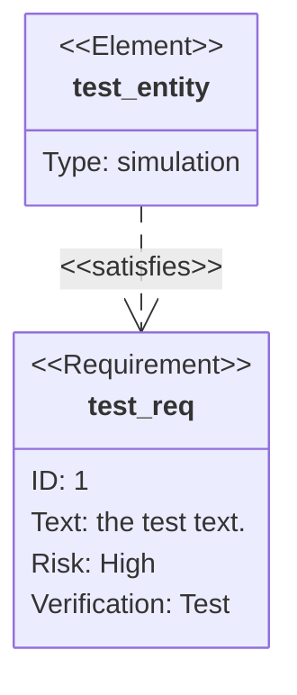

# Requirement Diagram Reference

Requirement diagrams document system requirements and their relationships — ideal for requirements engineering and systems design documentation.

## Basic Syntax



## Requirements

### Requirement Syntax

```text
<type> <name> {
    id: <identifier>
    text: <description>
    risk: <low|medium|high>
    verifymethod: <analysis|inspection|test|demonstration>
}
```

### Requirement Types

| Type | Description |
| --- | --- |
| `requirement` | General requirement |
| `functionalRequirement` | Describes what the system must do |
| `interfaceRequirement` | Describes system interfaces |
| `performanceRequirement` | Specifies performance constraints |
| `physicalRequirement` | Physical/hardware constraints |
| `designConstraint` | Design or implementation constraints |

### Risk Levels

- `low` — Minimal impact if requirement not met
- `medium` — Moderate impact
- `high` — Significant impact on system success

### Verification Methods

- `analysis` — Verified through mathematical or logical analysis
- `inspection` — Verified by visual examination
- `test` — Verified by testing
- `demonstration` — Verified by operating the system

## Elements

Elements represent entities (components, modules, subsystems) that satisfy or trace to requirements:

```text
element <name> {
    type: <component type>
    docref: <optional document reference>
}
```

```mermaid
requirementDiagram

    element auth_service {
        type: software component
        docref: auth-design.md
    }
```

## Relationships

Connect requirements and elements with labeled directed arrows:

```text
<source> - <relationship> -> <destination>
```

### Relationship Types

| Relationship | Meaning |
| --- | --- |
| `contains` | Parent requirement contains child |
| `copies` | Requirement is derived from another |
| `derives` | Requirement derives from another requirement |
| `satisfies` | Element satisfies a requirement |
| `verifies` | Element verifies a requirement |
| `refines` | Requirement refines/extends another |
| `traces` | Traceability link between items |

## Common Patterns

### Software Feature Requirements

```mermaid
requirementDiagram

    requirement user_auth {
        id: REQ-001
        text: Users must authenticate before accessing protected resources.
        risk: high
        verifymethod: test
    }

    functionalRequirement password_policy {
        id: REQ-002
        text: Passwords must be at least 12 characters with mixed case, numbers, and symbols.
        risk: medium
        verifymethod: test
    }

    performanceRequirement login_latency {
        id: REQ-003
        text: Authentication must complete within 500ms under normal load.
        risk: medium
        verifymethod: test
    }

    element auth_module {
        type: software component
        docref: auth-spec.md
    }

    user_auth - contains -> password_policy
    user_auth - contains -> login_latency
    auth_module - satisfies -> user_auth
    auth_module - verifies -> login_latency
```

### System Design Constraints

```mermaid
requirementDiagram

    requirement data_privacy {
        id: SYS-001
        text: System must comply with GDPR data privacy regulations.
        risk: high
        verifymethod: inspection
    }

    designConstraint encryption_req {
        id: SYS-002
        text: All personally identifiable information must be encrypted at rest using AES-256.
        risk: high
        verifymethod: analysis
    }

    interfaceRequirement api_standard {
        id: SYS-003
        text: All external APIs must follow RESTful conventions and return JSON.
        risk: low
        verifymethod: inspection
    }

    element data_layer {
        type: database layer
    }

    element api_gateway {
        type: service
    }

    data_privacy - derives -> encryption_req
    data_layer - satisfies -> encryption_req
    api_gateway - satisfies -> api_standard
```
