# Sequence Diagram Reference

Sequence diagrams show how processes operate with one another and in what order.

## Basic Syntax

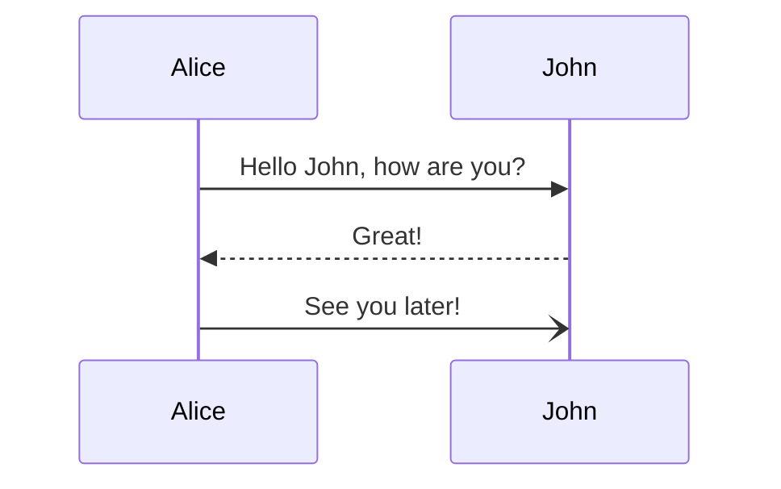
```mermaid
sequenceDiagram
    Alice->>John: Hello John, how are you?
    John-->>Alice: Great!
    Alice-)John: See you later!
```

**Important**: Avoid using the word "end" in participant names. If unavoidable, wrap it in parentheses `(end)`, brackets `[end]` or braces `{end}`.

## Participants

### Defining Participants

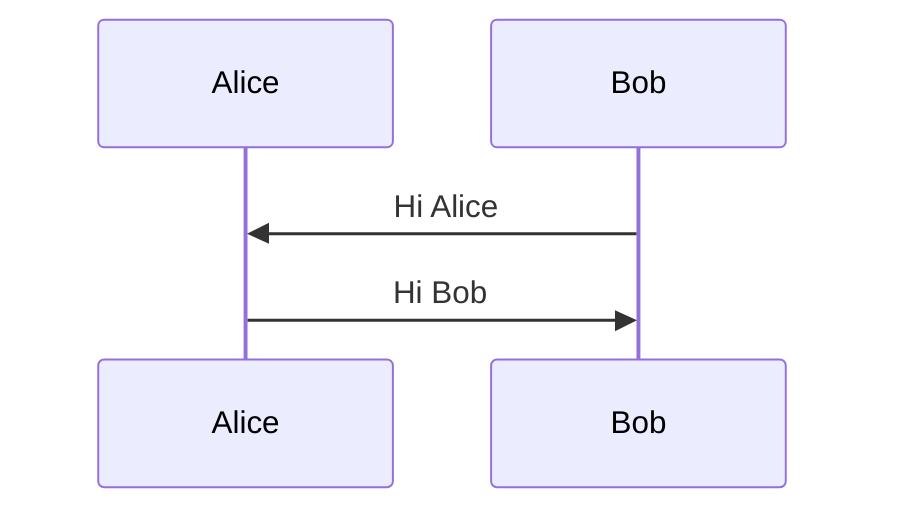
```mermaid
sequenceDiagram
    participant Alice
    participant Bob
    Bob->>Alice: Hi Alice
    Alice->>Bob: Hi Bob
```

Order of `participant` declarations controls display order (overrides order of first appearance).

### Participant Types

Use JSON configuration syntax to specify participant types:

| Type | Symbol | Syntax |
|------|--------|--------|
| Rectangle (default) | Rectangle with text | `participant Alice` |
| Actor | Stick figure | `actor Alice` |
| Boundary | Circle with line | `participant Alice@{ "type" : "boundary" }` |
| Control | Circle with arrow | `participant Alice@{ "type" : "control" }` |
| Entity | Circle with bottom line | `participant Alice@{ "type" : "entity" }` |
| Database | Cylinder | `participant Alice@{ "type" : "database" }` |
| Collections | Stacked rectangles | `participant Alice@{ "type" : "collections" }` |
| Queue | Queue shape | `participant Alice@{ "type" : "queue" }` |

**Example with types:**
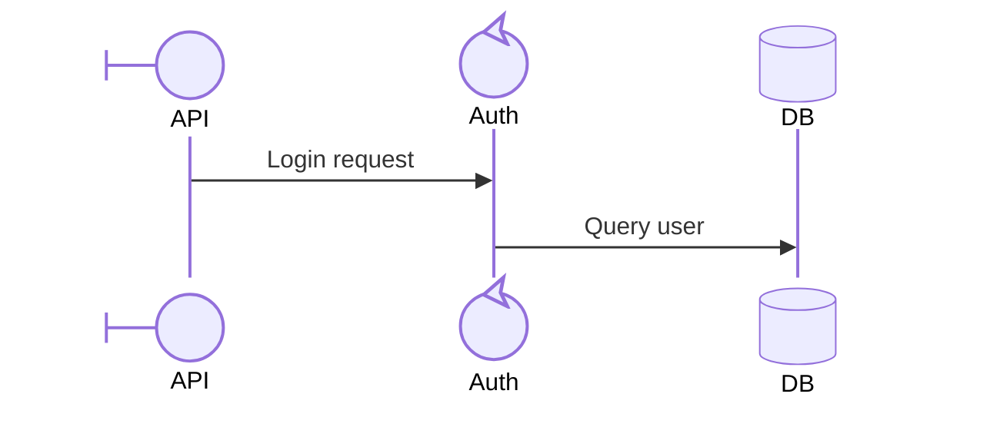
```mermaid
sequenceDiagram
    participant API@{ "type": "boundary" }
    participant Auth@{ "type": "control" }
    participant DB@{ "type": "database" }
    API->>Auth: Login request
    Auth->>DB: Query user
```

### Aliases

**External syntax (recommended):**
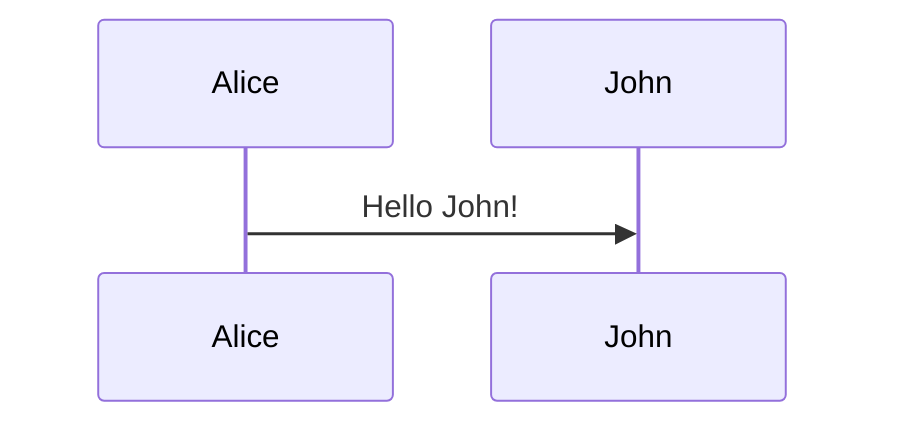
```mermaid
sequenceDiagram
    participant A as Alice
    participant J as John
    A->>J: Hello John!
```

**Inline syntax:**
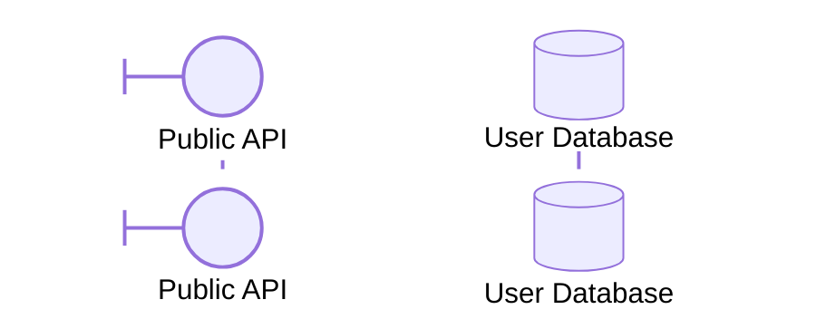
```mermaid
sequenceDiagram
    participant API@{ "type": "boundary", "alias": "Public API" }
    participant DB@{ "type": "database", "alias": "User Database" }
```

**Combined (external takes precedence):**
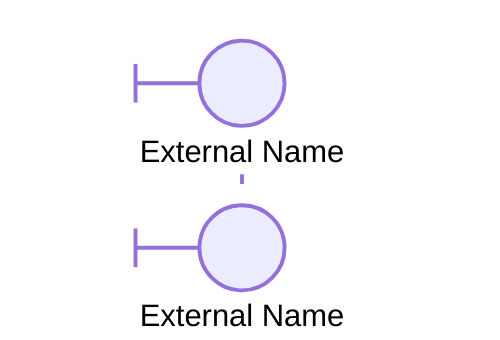
```mermaid
sequenceDiagram
    participant API@{ "type": "boundary", "alias": "Internal" } as External Name
    # "External Name" displays, not "Internal"
```

## Messages

### Arrow Types

| Type | Description | Syntax |
|------|-------------|--------|
| Solid | Synchronous message | `->>` |
| Dotted | Asynchronous/response | `-->>` |
| Solid with cross | Lost message | `-x` |
| Dotted with cross | Lost async message | `--x` |
| Solid open arrow | Async message | `-)` |
| Dotted open arrow | Async response | `--)` |

**Arrowhead variations:**
- No arrowhead: Add `-` before last `>`  
  Example: `Alice--John` (dotted line, no arrow)

**Example:**
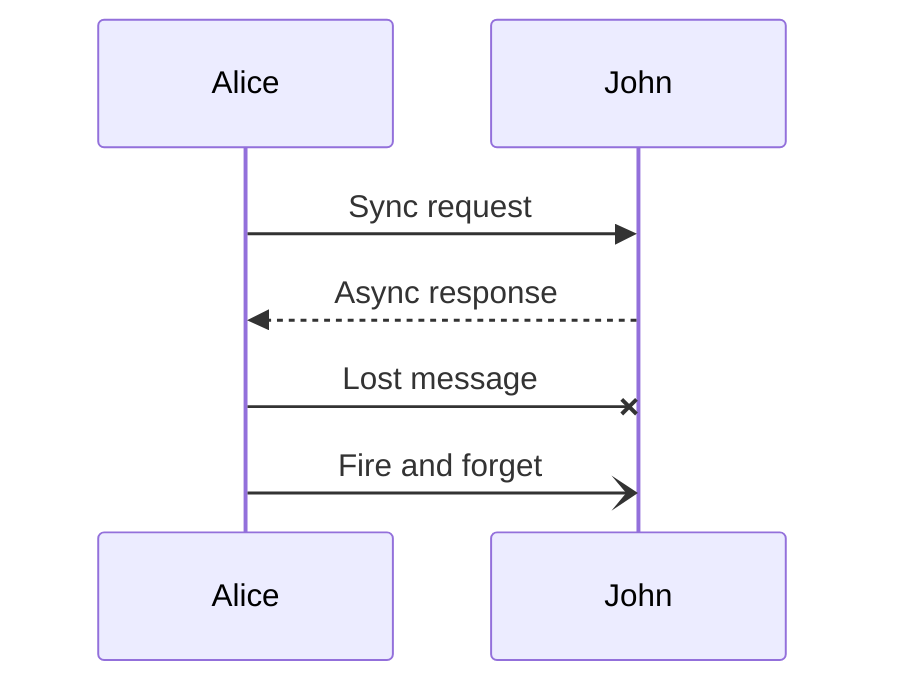
```mermaid
sequenceDiagram
    Alice->>John: Sync request
    John-->>Alice: Async response
    Alice-xJohn: Lost message
    Alice-)John: Fire and forget
```

### Message Activation

Activate/deactivate participant lifelines:

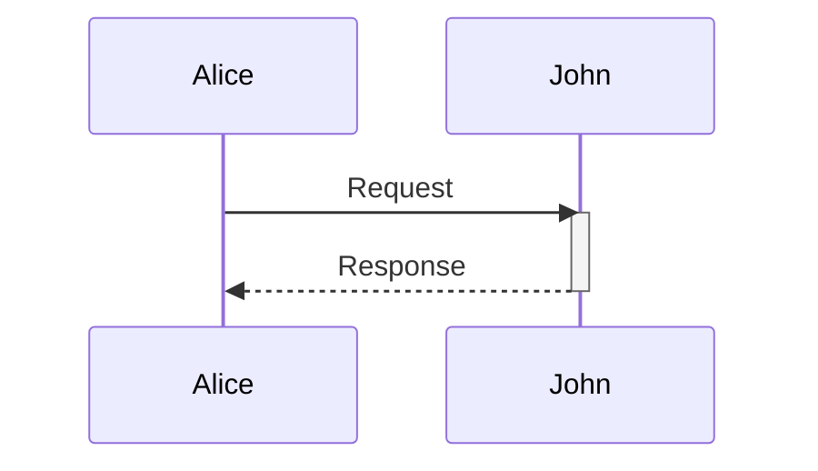
```mermaid
sequenceDiagram
    Alice->>John: Request
    activate John
    John-->>Alice: Response
    deactivate John
```

**Shorthand:**
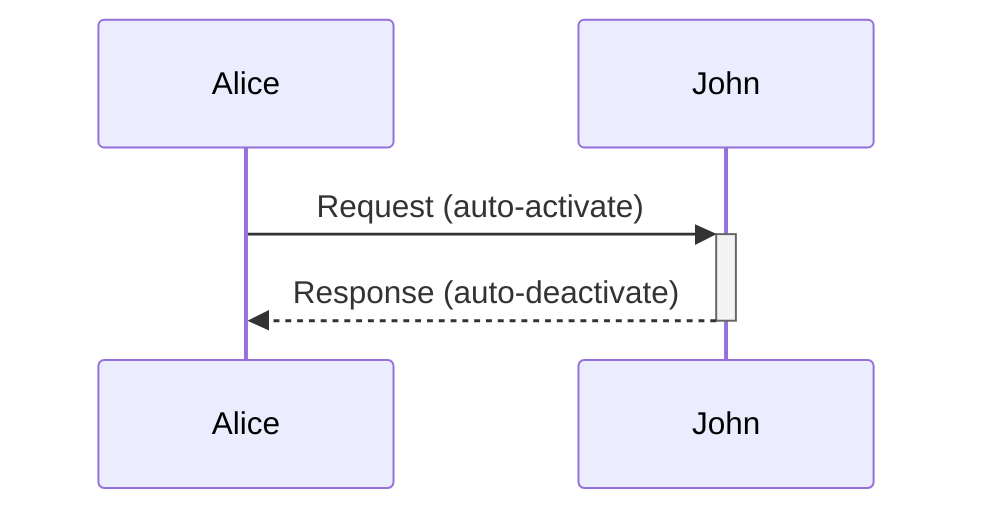
```mermaid
sequenceDiagram
    Alice->>+John: Request (auto-activate)
    John-->>-Alice: Response (auto-deactivate)
```

**Stacking activations:**
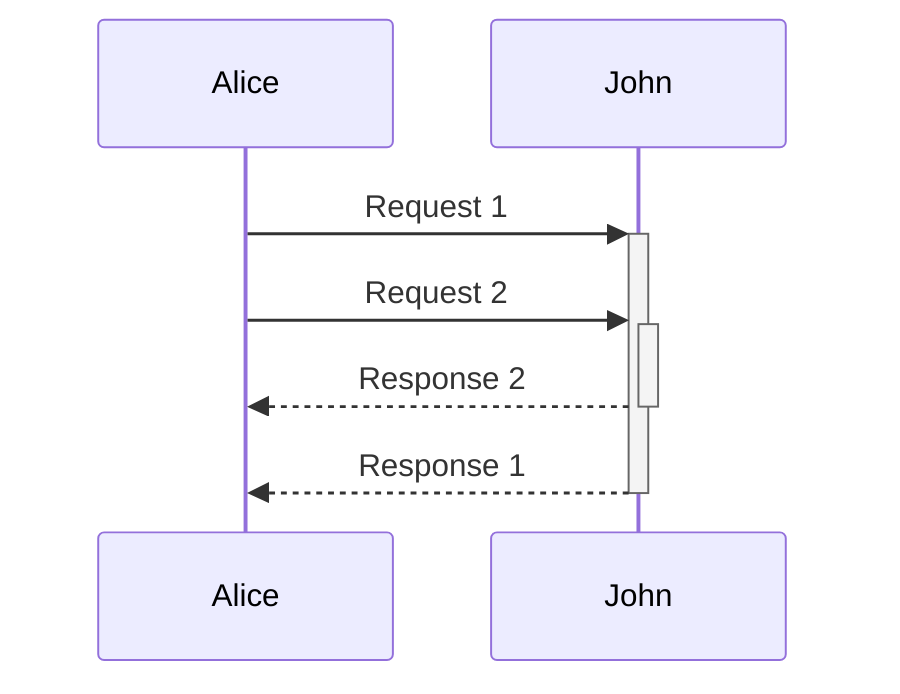
```mermaid
sequenceDiagram
    Alice->>+John: Request 1
    Alice->>+John: Request 2
    John-->>-Alice: Response 2
    John-->>-Alice: Response 1
```

## Notes

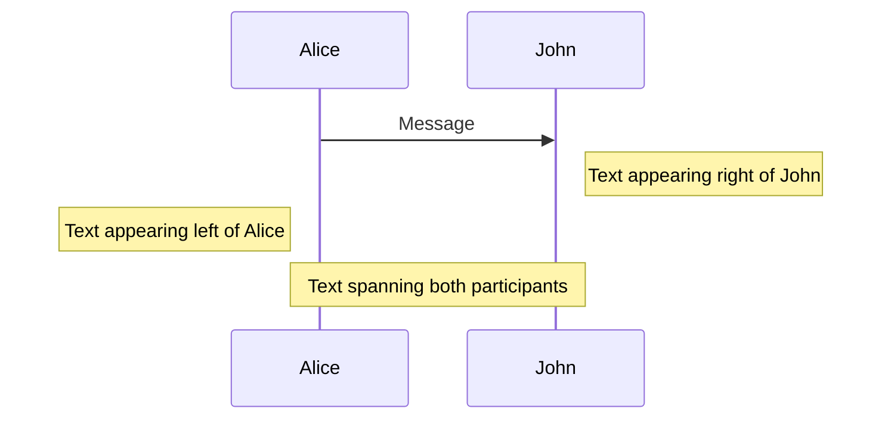
```mermaid
sequenceDiagram
    Alice->>John: Message
    Note right of John: Text appearing right of John
    Note left of Alice: Text appearing left of Alice
    Note over Alice,John: Text spanning both participants
```

## Loops

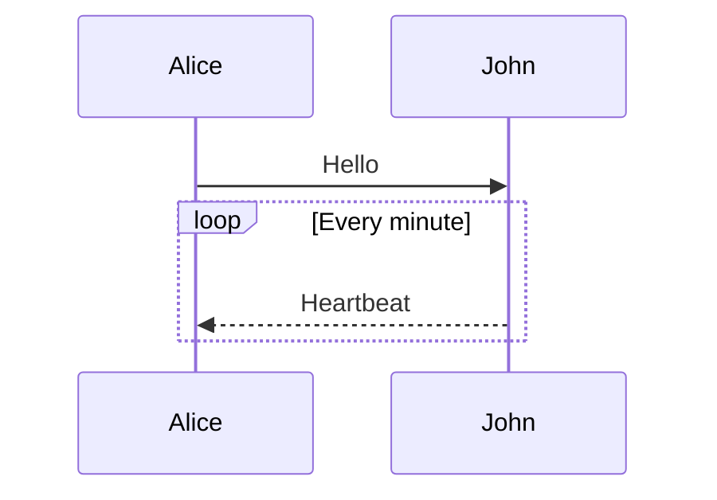
```mermaid
sequenceDiagram
    Alice->>John: Hello
    loop Every minute
        John-->>Alice: Heartbeat
    end
```

## Alternative Paths

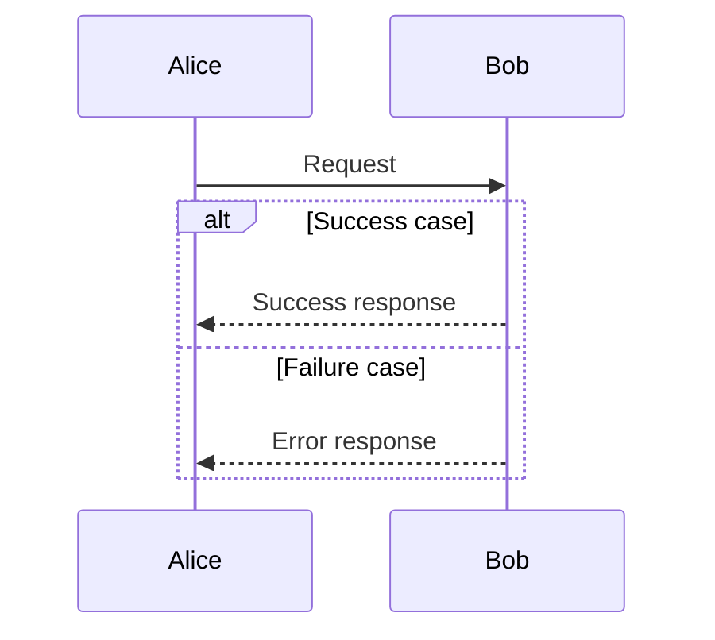
```mermaid
sequenceDiagram
    Alice->>Bob: Request
    alt Success case
        Bob-->>Alice: Success response
    else Failure case
        Bob-->>Alice: Error response
    end
```

**Optional paths:**
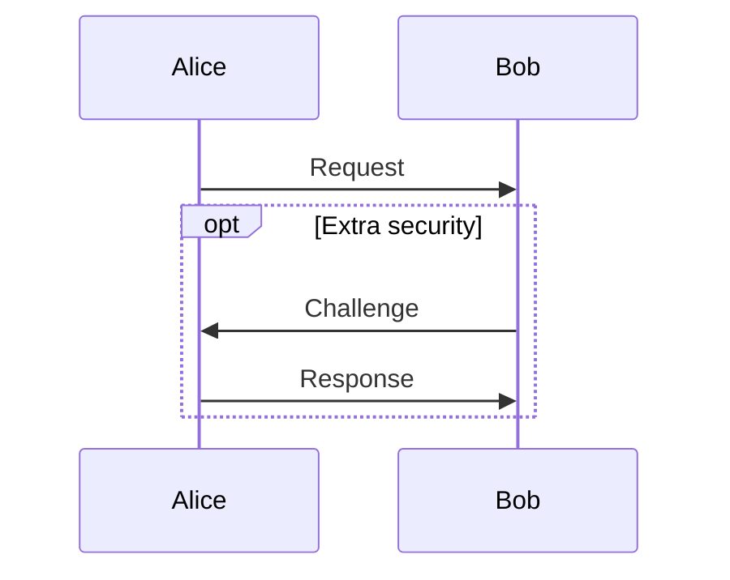
```mermaid
sequenceDiagram
    Alice->>Bob: Request
    opt Extra security
        Bob->>Alice: Challenge
        Alice->>Bob: Response
    end
```

## Parallel Execution

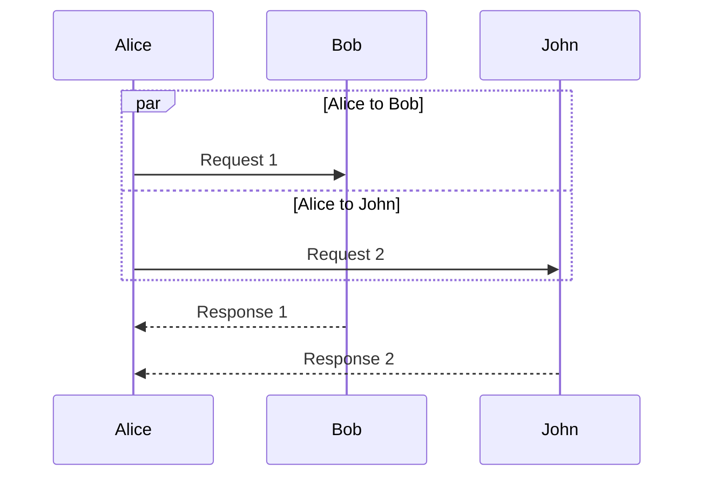
```mermaid
sequenceDiagram
    par Alice to Bob
        Alice->>Bob: Request 1
    and Alice to John
        Alice->>John: Request 2
    end
    Bob-->>Alice: Response 1
    John-->>Alice: Response 2
```

## Critical Region

Represents critical/atomic sections:

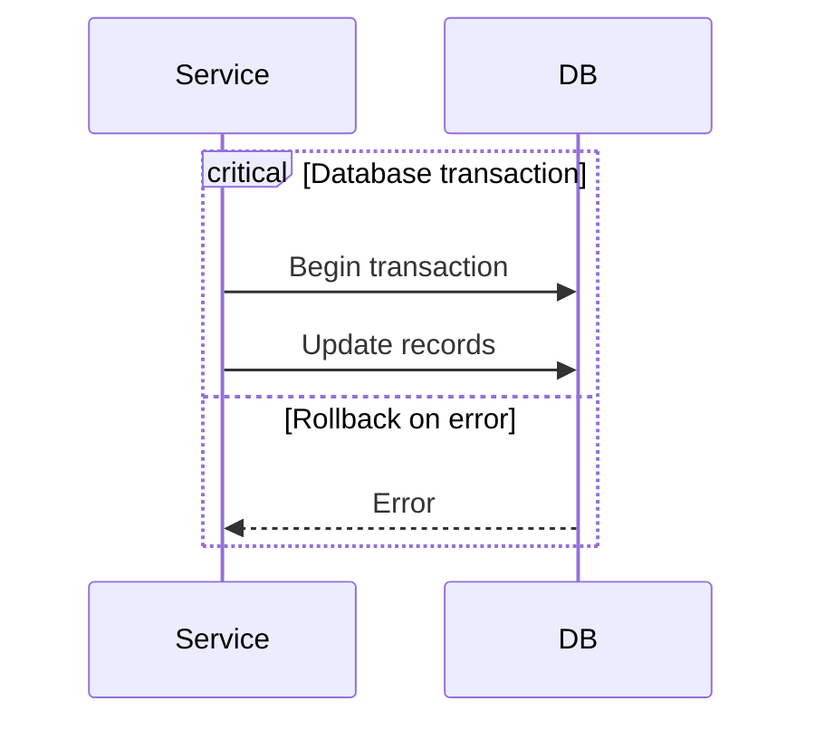
```mermaid
sequenceDiagram
    critical Database transaction
        Service->>DB: Begin transaction
        Service->>DB: Update records
    option Rollback on error
        DB-->>Service: Error
    end
```

## Break

Stop remaining sequences (like early return):

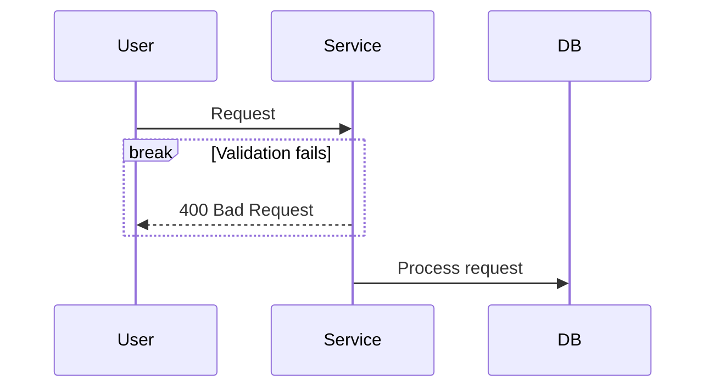
```mermaid
sequenceDiagram
    User->>Service: Request
    break Validation fails
        Service-->>User: 400 Bad Request
    end
    Service->>DB: Process request
```

## Background Highlighting

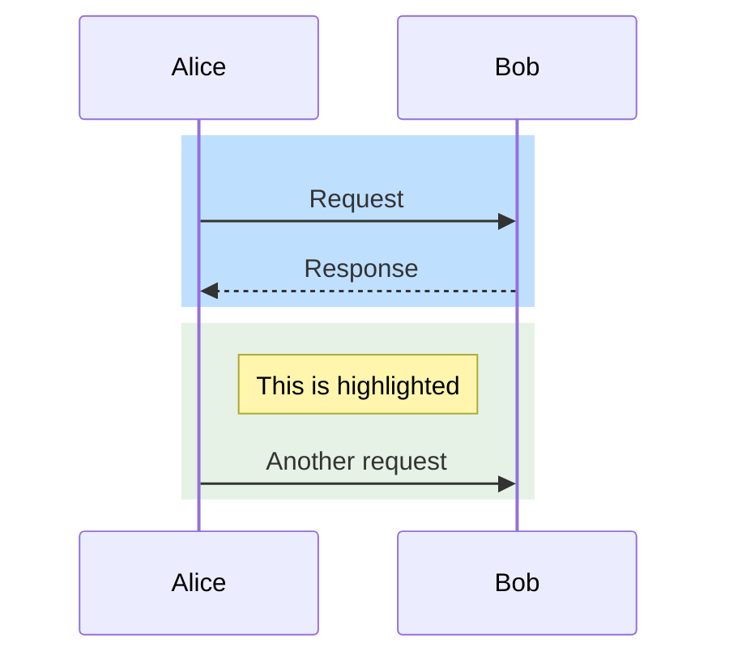
```mermaid
sequenceDiagram
    rect rgb(191, 223, 255)
        Alice->>Bob: Request
        Bob-->>Alice: Response
    end
    rect rgba(0, 128, 0, 0.1)
    note right of Alice: This is highlighted
        Alice->>Bob: Another request
    end
```

## Actor Creation/Destruction (v10.3.0+)

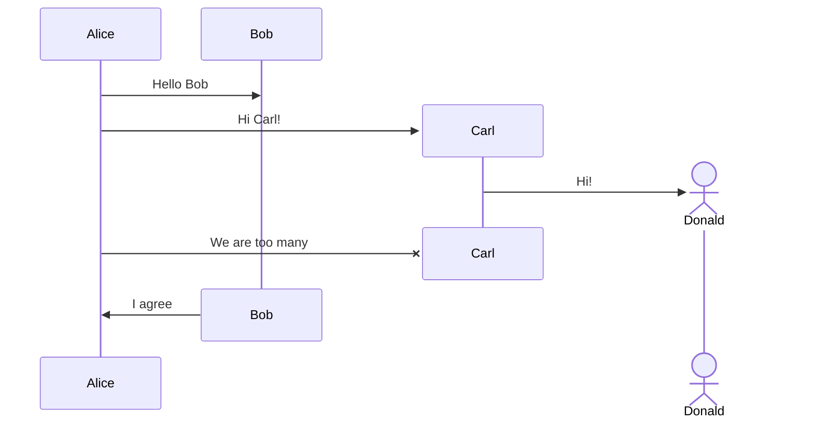
```mermaid
sequenceDiagram
    Alice->>Bob: Hello Bob
    create participant Carl
    Alice->>Carl: Hi Carl!
    create actor D as Donald
    Carl->>D: Hi!
    destroy Carl
    Alice-xCarl: We are too many
    destroy Bob
    Bob->>Alice: I agree
```

**Rules:**
- Only recipients can be created
- Either sender or recipient can be destroyed
- `create` supports actor/participant types and aliases

## Grouping / Box

Group participants in colored boxes:

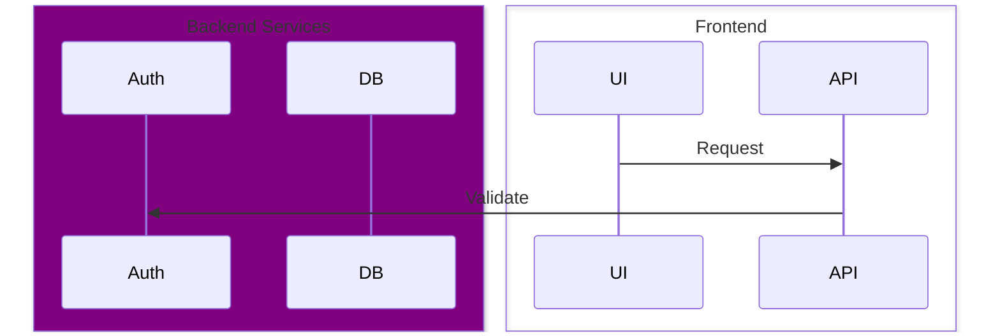
```mermaid
sequenceDiagram
    box Purple Backend Services
        participant Auth
        participant DB
    end
    box Transparent Frontend
        participant UI
        participant API
    end
    UI->>API: Request
    API->>Auth: Validate
```

**Supported colors:**
- Named colors: `box Purple Backend`
- Hex: `box #FF5733`
- RGB: `box rgb(33,66,99)`
- RGBA: `box rgba(33,66,99,0.5)`
- Transparent: `box transparent Aqua` (forces transparency even if "Aqua" is color name)

## Sequence Numbering

**Via diagram code:**
```mermaid
sequenceDiagram
    autonumber
    Alice->>John: Message 1
    John->>Alice: Message 2
```

**With custom start/increment:**
```mermaid
sequenceDiagram
    autonumber 10 5
    # Starts at 10, increments by 5: 10, 15, 20...
```

## Actor Menus

Add clickable links to participants:

**Simple syntax:**
```mermaid
sequenceDiagram
    participant Alice
    participant John
    link Alice: Dashboard @ https://dashboard.contoso.com/alice
    link Alice: Wiki @ https://wiki.contoso.com/alice
    link John: Dashboard @ https://dashboard.contoso.com/john
```

**JSON syntax:**
```mermaid
sequenceDiagram
    participant Alice
    links Alice: {"Dashboard": "https://dashboard.contoso.com/alice", "Wiki": "https://wiki.contoso.com/alice"}
```

## Comments

```mermaid
sequenceDiagram
    Alice->>John: Hello
    %% This is a comment
    John-->>Alice: Hi
```

## Entity Codes

Escape special characters:

```mermaid
sequenceDiagram
    A->>B: I #9829; you!
    B->>A: I #9829; you #infin; times more!
```

- Numbers are base 10
- Use `#35;` for `#`
- HTML character names supported
- Use `#59;` for semicolon in message text

## Common Patterns

### Request-Response with Validation

```mermaid
sequenceDiagram
    participant Client
    participant API@{ "type": "boundary" }
    participant Auth@{ "type": "control" }
    participant DB@{ "type": "database" }
    
    Client->>+API: POST /api/login
    API->>+Auth: Validate credentials
    Auth->>+DB: Query user
    DB-->>-Auth: User data
    
    alt Valid credentials
        Auth-->>API: Token
        API-->>Client: 200 OK + Token
    else Invalid credentials
        Auth-->>API: Error
        API-->>-Client: 401 Unauthorized
    end
    deactivate Auth
```

### Microservices Communication

```mermaid
sequenceDiagram
    box LightBlue Client Layer
        participant User
        participant Gateway
    end
    box LightGreen Service Layer
        participant Auth
        participant Order
    end
    box LightYellow Data Layer
        participant Cache
        participant DB
    end
    
    User->>+Gateway: Place order
    Gateway->>+Auth: Verify token
    Auth->>Cache: Check session
    Cache-->>Auth: Session valid
    Auth-->>-Gateway: Authorized
    
    Gateway->>+Order: Create order
    Order->>+DB: Save order
    DB-->>-Order: Order ID
    Order-->>-Gateway: Order created
    Gateway-->>-User: Success
```

### Error Handling Pattern

```mermaid
sequenceDiagram
    participant Client
    participant Service
    participant DB
    
    Client->>+Service: Request
    Service->>+DB: Query
    
    critical Transaction
        DB->>DB: Begin
        DB->>DB: Execute
    option Error
        DB-->>Service: Rollback
        Service-->>Client: 500 Error
    end
    
    DB-->>-Service: Success
    Service-->>-Client: 200 OK
```

## Configuration Parameters

Key JavaScript configuration options:

```javascript
mermaid.sequenceConfig = {
  mirrorActors: true,        // Show actors at bottom too
  diagramMarginX: 50,
  diagramMarginY: 10,
  boxTextMargin: 5,
  noteMargin: 10,
  messageMargin: 35,
  actorFontSize: 14,
  noteFontSize: 14,
  messageFontSize: 16
};
```

## CSS Classes for Styling

| Class | Target |
|-------|--------|
| `actor` | Actor box |
| `actor-top` | Actor at diagram top |
| `actor-bottom` | Actor at diagram bottom |
| `text.actor` | All actor text |
| `text.actor-box` | Actor box text |
| `text.actor-man` | Actor figure text |
| `actor-line` | Vertical lifeline |
| `messageLine0` | Solid message line |
| `messageLine1` | Dotted message line |
| `messageText` | Message label text |
| `labelBox` | Loop label box |
| `labelText` | Loop label text |
| `loopText` | Loop content text |
| `loopLine` | Loop border lines |
| `note` | Note box |
| `noteText` | Note text |
