# State Diagram Reference

State diagrams model how a system transitions between states, ideal for state machines, protocol flows, and lifecycle diagrams.

## Basic Syntax

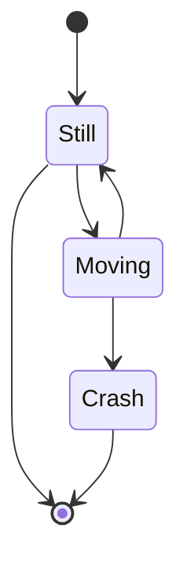

Use `[*]` for start and end points. `stateDiagram-v2` is the current version (preferred over `stateDiagram`).

## States

### Simple States

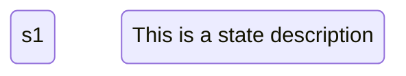

**Two ways to define states:**

- `stateId` - Simple state with ID as label
- `state "Label" as stateId` - State with custom label

### Composite States (Nested)

Group related states into a composite state:

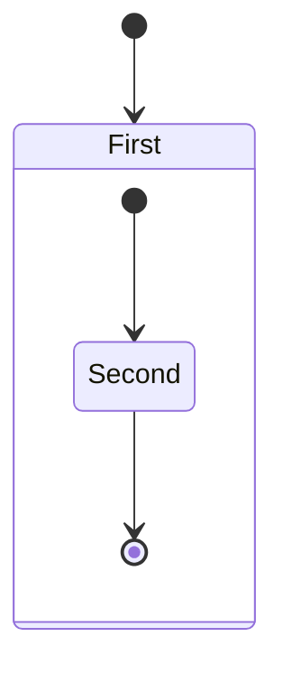

**Rules:**

- Composite states can be nested to any depth
- Each composite state has its own `[*]` start/end
- Transitions can go between inner and outer states

### Fork and Join (Concurrency)

Model parallel state execution:

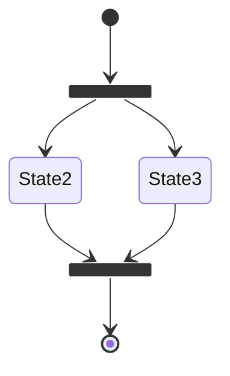

**Syntax:** `state stateName <<fork>>` or `state stateName <<join>>`

### Choice (Conditional)

Model conditional branching:

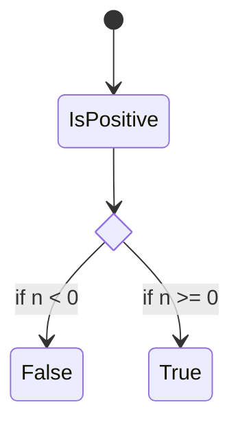

**Syntax:** `state stateName <<choice>>`

## Transitions

### Basic Transitions

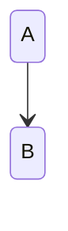

### Labeled Transitions

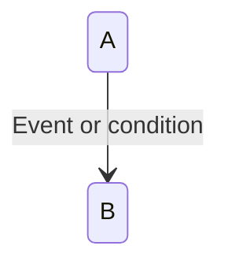

**Syntax:** `stateA --> stateB : label`

## Notes

Add annotations to states:

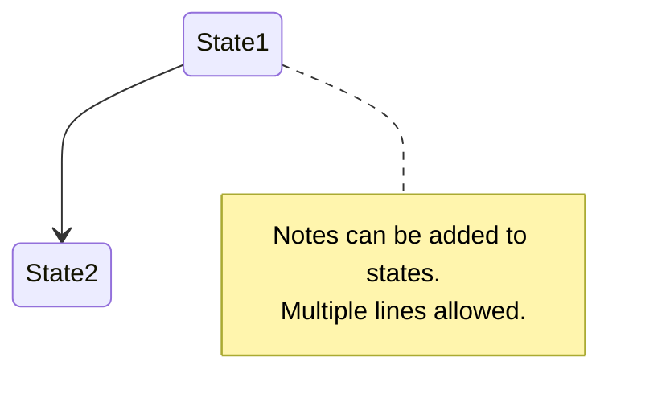

**Syntax:**

```text
note right of stateName
    Note content
end note
```

Or: `note left of stateName`

## Concurrency (Parallel Regions)

Divide composite states into concurrent regions with `--`:

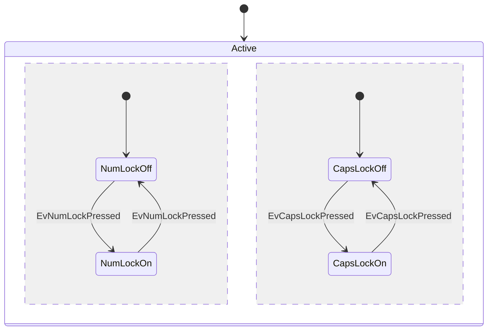

## Direction

Control diagram layout:

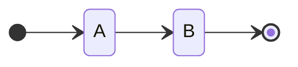

**Options:** `TB` (top-bottom, default), `BT`, `LR` (left-right), `RL`

## Comments

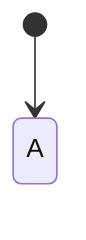

## Styling

### classDef and class

Apply styles to states using class definitions:


**Syntax:**

- Define: `classDef className fill:#f9f,stroke:#333`
- Apply inline: `stateName:::className`

## Common Patterns

### Order Lifecycle

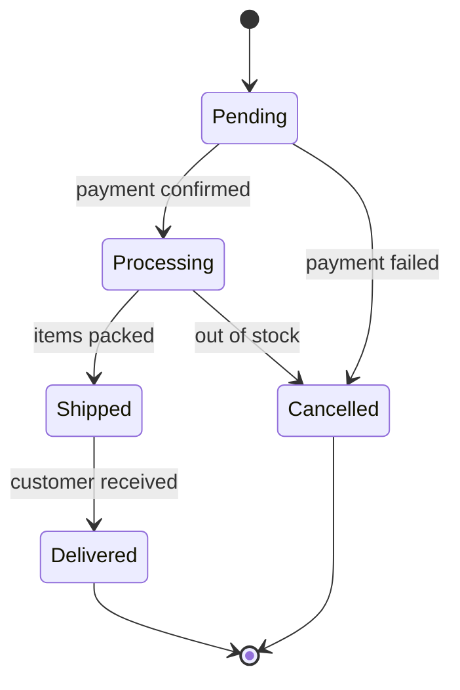

### Authentication Flow

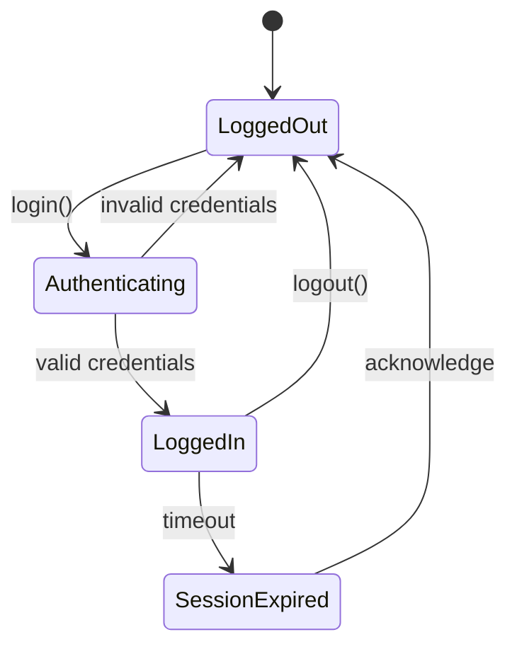

### Traffic Light

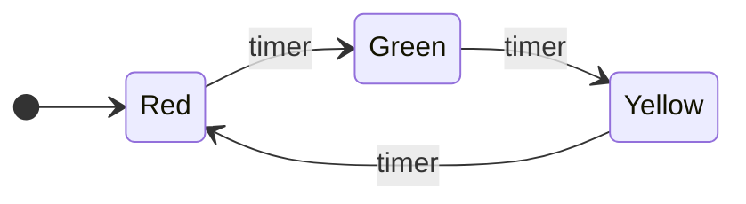
