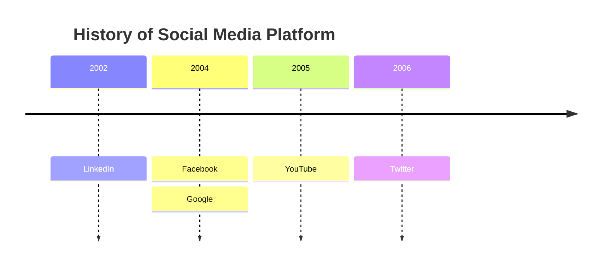
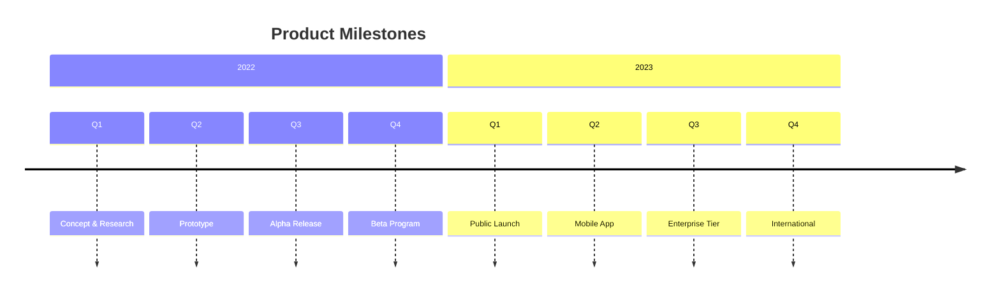
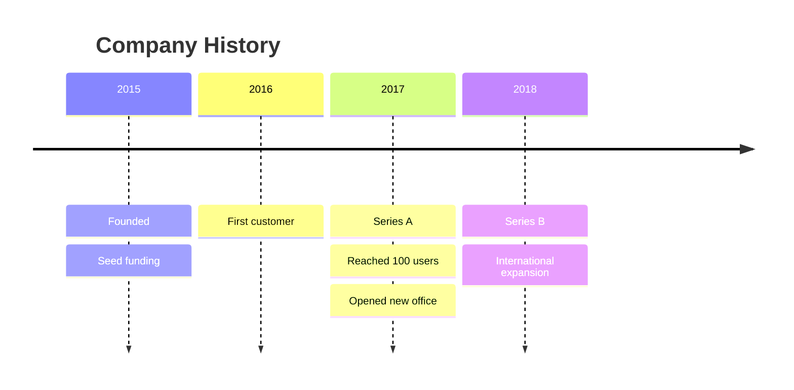
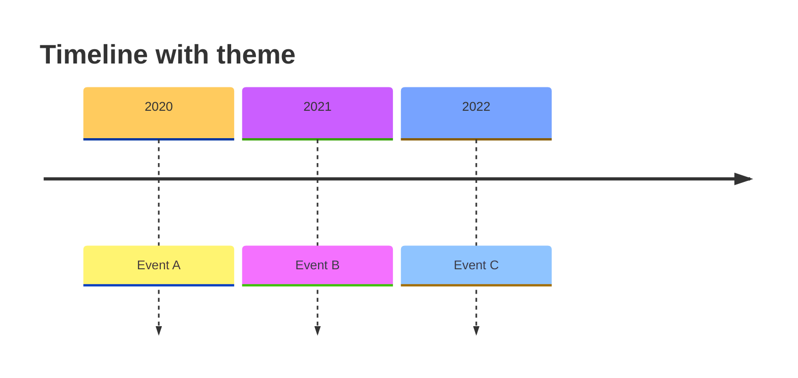
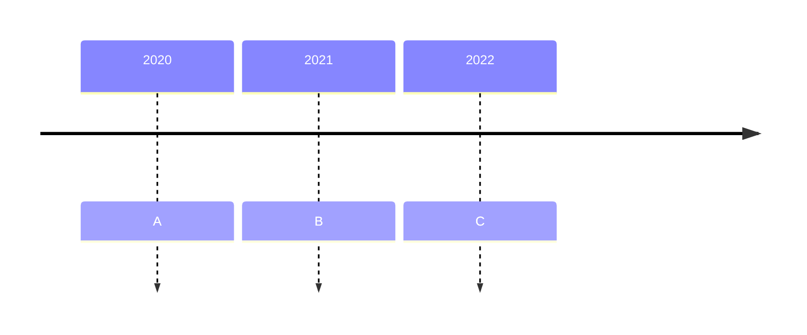
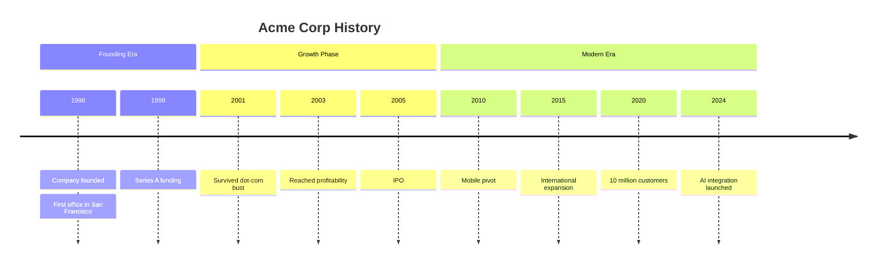
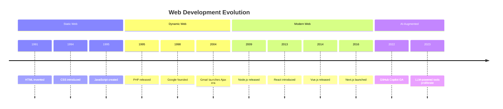
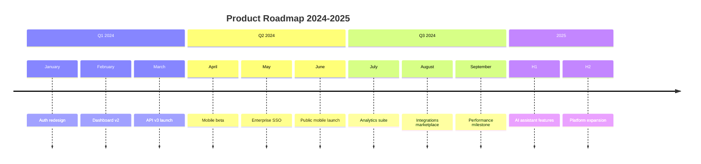

# Timeline Reference

Timeline diagrams display events in chronological order — ideal for historical timelines, roadmaps, product evolution, and milestone tracking.

## Basic Syntax



Multiple events on the same time point are stacked by repeating the `:` entry.

## Title

Add an optional title:

```text
title My Timeline
```

## Sections

Group time periods under section headings:



Sections visually separate related periods with a distinct background color.

## Multiple Events Per Period

List multiple events under the same time label:



## Themes and Styling

Apply global themes via frontmatter:



### disableMulticolor

By default, each time period gets a different color. Disable this for a uniform look:



## Common Patterns

### Company History



### Technology Evolution



### Product Roadmap


