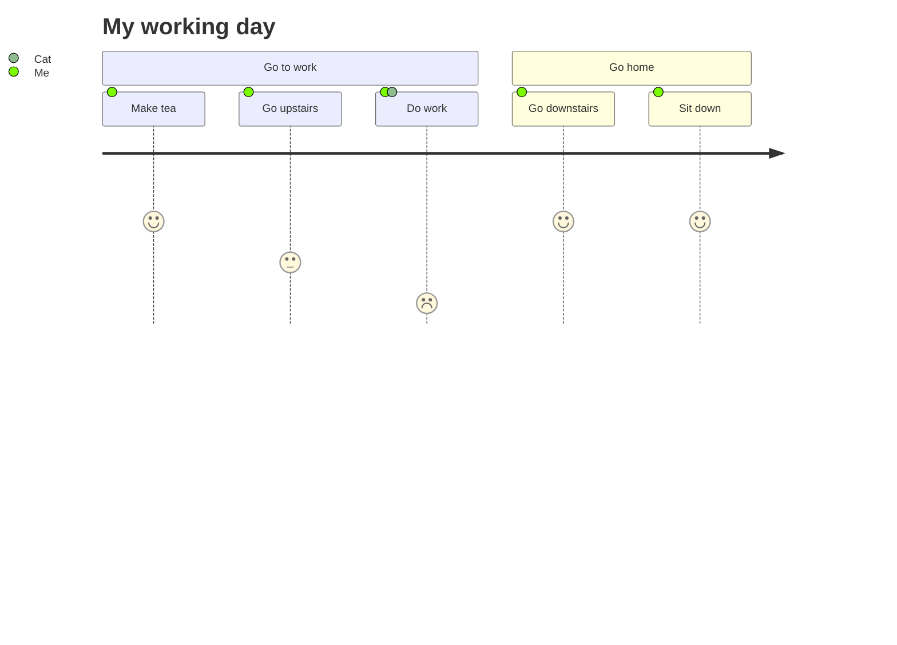
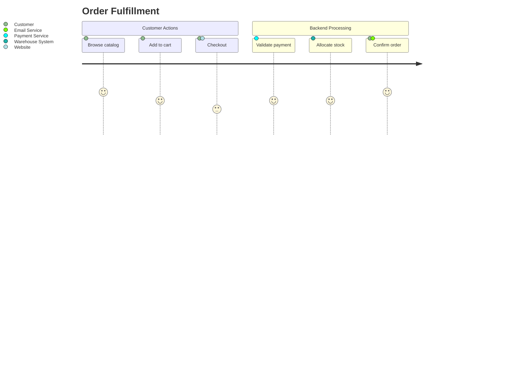
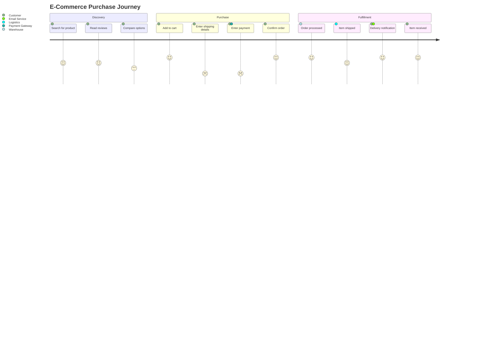
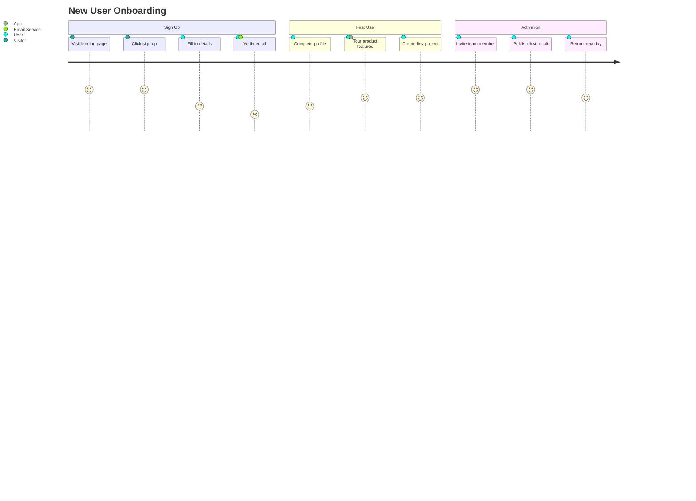
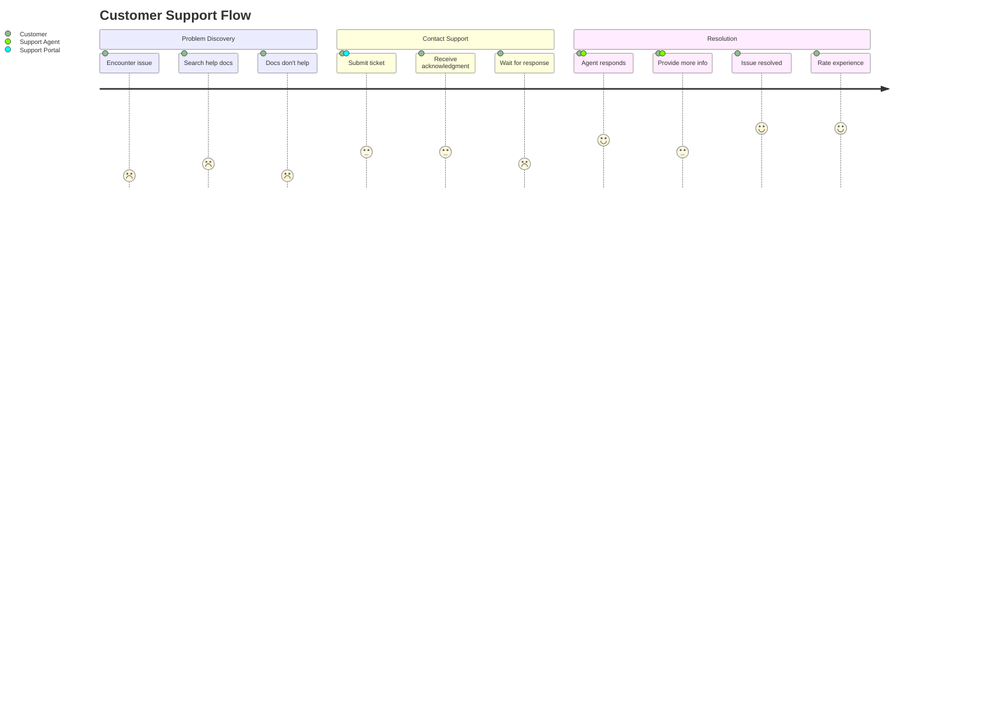

# User Journey Diagram Reference

User journey diagrams map the experience of a user completing a task — showing steps, satisfaction scores, and which actors are involved.

## Basic Syntax



Each task line follows the format: `Task description: score: Actor1, Actor2, ...`

## Structure

### title

Optional diagram title:

```text
title User Journey: Checkout Flow
```

### section

Group related steps under a named phase:

```text
section Phase Name
    Step 1: score: Actor
    Step 2: score: Actor
```

### Tasks

Each task entry has three parts:

```text
<description>: <score>: <actors>
```

- **description** — What the user is doing (free text)
- **score** — Satisfaction rating from 1 (very negative) to 5 (very positive)
- **actors** — Comma-separated list of participants (person, system, team, etc.)

**Score visual meaning:**

- `1`–`2` — Negative experience (red tones)
- `3` — Neutral
- `4`–`5` — Positive experience (green tones)

## Multiple Actors

Tasks can involve multiple actors, rendered as stacked blocks:



## Common Patterns

### E-Commerce Purchase Journey



### User Onboarding



### Support Request Journey



## Tips

- Aim for 5–10 steps per section for readability
- Use scores honestly to highlight pain points — low scores show where to improve
- Include all actors that meaningfully participate in each step
- Sections should map to distinct phases of the user's experience
